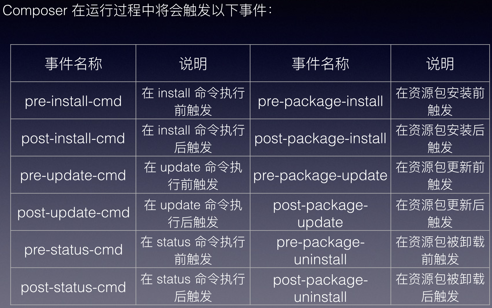

# composer

Composer 是一个非常流行的 PHP 包依赖管理工。

Composer 非常的简单,通过简单的一条命令将需要的代码包下载到 vendor 目录下,引入包并使用。

其中的关键在于你项目定义的 composer.json,可以定义项目需要依赖的包(可能有多个),而依赖的包可能又依赖其他的包(这就是组件的好处),这些都不用你烦心,Composer 会自动下载你需要的一切,一切在于 composer.json 的定义。

## composer 触发事件

## 目录

- [composer 简介](composer-introduction.md)
- [composer 镜像](composer-mirror.md)
- [composer 授权](composer-authentication.md)
- [PHP 扩展包](packages/README.md)
  - [Composer 并行加速插件](packages/parallel-install.md)
  - [PHP CS 格式化](packages/php-cs.md)
