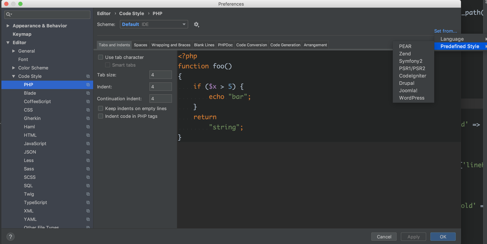
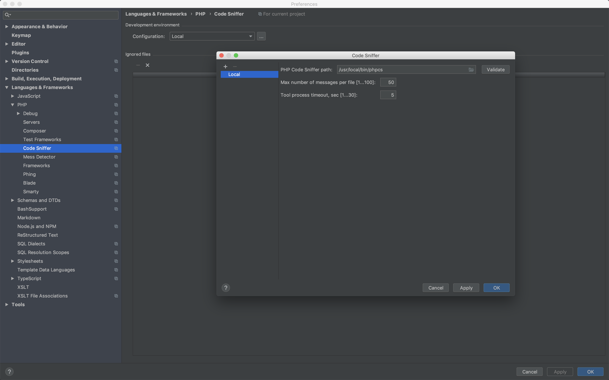
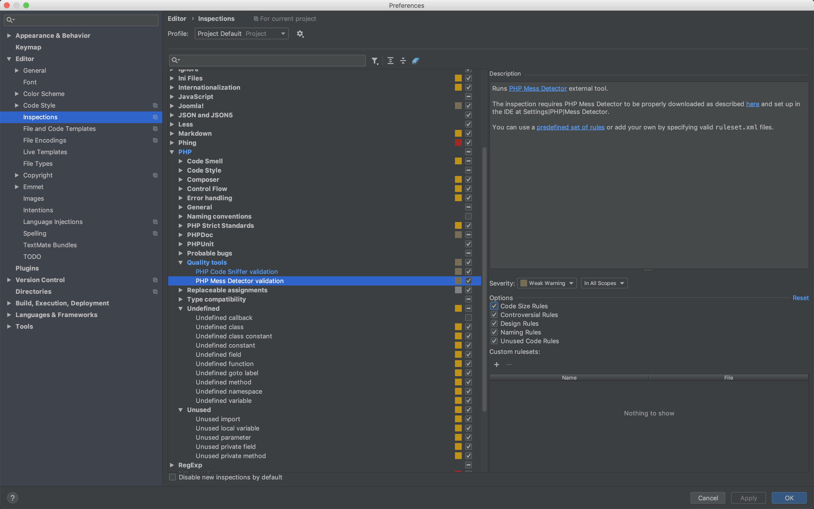
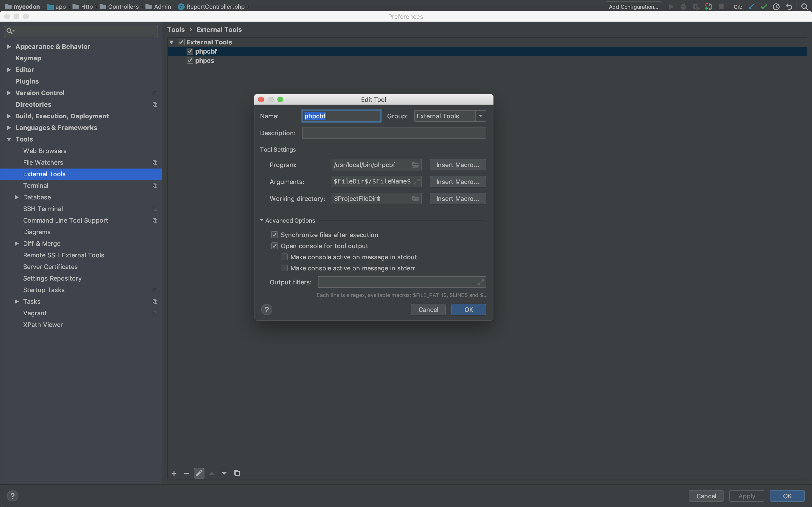

# PHP 代码风格一致性

## 一、背景

PHP 开发团队统一 PSR-2 的编码风格规范。

通过 git 的钩子实现，具体原理：如果提交的代码不符 PSR-2 代码风格规范，通过 git 钩子将不其 commit，并且给出具体行号和具体的原因，同时可以通过命令快速格式化。

具体过程：

1. 安装 PHP-CS
2. 配置 PHP-CS
3. 集成到编辑器
4. git 触发检测

## 二、PHP-CS 简介

[PHP_CodeSniffer](https://github.com/squizlabs/PHP_CodeSniffer)（简称为 PHP-CS）是一个代码风格检测工具， 要求 PHP 5.4.0 以上版本，包含两类脚本：`phpcs` 和 `phpcbf`。

### phpcs

`phpcs` 脚本对 `PHP`、`JavaScript`、`CSS` 文件定义了一系列的代码规范（通常使用官方的代码规范标准，比如 `PHP` 的 `PSR2`），能够检测出不符合代码规范的代码并发出警告或报错（可设置报错等级）。

### phpcbf

`phpcbf` 脚本能自动修正代码格式上不符合规范的部分。比如 `PSR2` 规范中对每一个 `PHP` 文件的结尾都需要有一行空行，那么运行这个脚本后就能自动在结尾处加上一行空行。

## 三、安装 PHP-CS

PHP-CS 可以用来检测代码是否符合 PSR-2 规范，同时支持对不符合规范的代码自动格式化，让其转成 PSR-2 的编码风格。

### 3.1 安装 composer

PHP-CS 依赖于 composer，请自行安装。

### 3.2 安装 PHP-CS

安装 PHP-CS：

```shell
composer global require "squizlabs/php_codesniffer=*"
```

当命令执行完成之后，在当前用户的主目录下创建一个`.composer`目录，包含 PHP-CS，可以执行下方命令来验证是否安装成功：

```shell
~/.composer/vendor/bin/phpcs  --version
```

### 3.3 全局使用

可以将 PHP-CS 路径加入到全局中：

```shell
ln -s ~/.composer/vendor/bin/phpcs /usr/local/bin/phpcs
ln -s ~/.composer/vendor/bin/phpcbf /usr/local/bin/phpcbf
```

使用下面的命令验证：

```shell
phpcs --version
```

### 3.4 设置默认标准

phpcs 默认的编码格式，命令如下：

```shell
phpcs --config-set default_standard PSR2
phpcbf --config-set default_standard PSR2
```

### 3.5 phpcs 检测

```shell
phpcs test.php
```

### 3.5 phpcbf 格式化

自动格式化编码风格命令:

```shell
phpcbf test.php
```

## 四、编辑器配置

### VScode

安装 phpcs 扩展，配置 PSR-2。

```conf
 {
     "phpcs.standard": "PSR2"
 }
```

### PHPStorm

1. 设置->code style -> PHP 中选择风格为 psr1/psr2

   

2. 设置->languages->php->code sniffer 中设置 phpcs 的路径

   

3. 设置->Editor->Inspections 展开点击右侧的 PHP，勾选 Quality tools 下面的两个 PHP 选项， PHP Code Sniffer validation 选择使用 PSR2， PHP Mess Detector validation 选择全部 options：

   

### 集成 phpcs

在 PHPstorm 集成 phpcs 检测规范的功能，设置路径:Tools->External Tools->add-> (/usr/local/bin/phpcs ) ($FileDir$/$FileName$)


### 集成 phpcbf

在 PHPstorm 集成 phpcbf 自动格式化功能，设置路径:Tools->External Tools->add-> (/usr/local/bin/phpcbf ) ($FileDir$/$FileName$)



## 五、Git 配置篇

在 git 钩子里面增加强制的策略，git 钩子脚本存放于项目下 `.git/hooks/**`文件夹下，添加一个 commit 事件。

### 新增钩子文件

新增一个文件 `./.git/hooks/pre-commit`,然后把下面的脚本放进去，之后再保存。

```shell
#!/bin/sh
PHPCS_BIN=/usr/local/bin/phpcs
PHPCS_CODING_STANDARD=PSR2
PHPCS_FILE_PATTERN="\.(php)$"

FILES=$(git diff HEAD^..HEAD --stat)

if [ "$FILES" == "" ]; then
 exit 0
fi

for FILE in $FILES
do
 echo "$FILE" | egrep -q "$PHPCS_FILE_PATTERN"
 RETVAL=$?
 if [ "$RETVAL" -eq "0" ]
 then

     PHPCS_OUTPUT=$($PHPCS_BIN --standard=$PHPCS_CODING_STANDARD $FILE)
     PHPCS_RETVAL=$?

     if [ $PHPCS_RETVAL -ne 0 ];
     then
         echo $PHPCS_OUTPUT
         exit 1
     fi
 fi
done
exit 0
```

需要注意的是让这个文件有可执行权限，最直接的办法就是设置为 777，参考命令如下：

```shell
chmod 777 .git/hooks/pre-commit
```

## 参考

- 汤青松：[使用 PHPCS+GIT 钩子保障团队开发中代码风格一致性实践](https://zhuanlan.zhihu.com/p/41813339)
- 阅码人生：[PHP 系列：代码规范之 Code Sniffer](https://laravel-china.org/articles/5646/php-series-code-sniffer-for-code-specification)
- squizlabs：[PHP_CodeSniffer](https://github.com/squizlabs/PHP_CodeSniffer)
