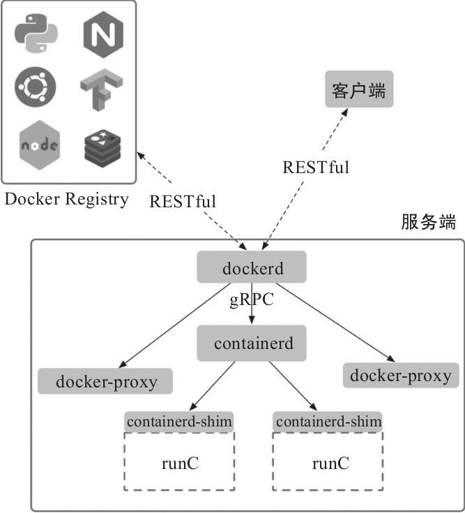

# 基本架构

Docker 目前采用了标准的 C/S 架构，包括客户端、服务端两大核心组件，同时通过镜像仓库来存储镜像。客户端和服务端既可以运行在一个机器上，也可通过 socket 或者 RESTful API 来进行通信。

## 服务端

Docker 服务端一般在宿主主机后台运行，dockerd 作为服务端接受来自客户的请求，并通过 containerd 具体处理与容器相关的请求，包括创建、运行、删除容器等。

服务端主要包括四个组件：

- dockerd：
    为客户端提供 RESTful API，响应来自客户端的请求，采用模块化的架构，通过专门的 Engine 模块来分发管理各个来自客户端的任务。可以单独升级；

- docker-proxy：
    dockerd 的子进程，当需要进行容器端口映射时，docker-proxy 完成网络映射配置；

- containerd：
    dockerd 的子进程，提供 gRPC 接口响应来自 dockerd 的请求，对下管理 runC 镜像和容器环境。可以单独升级；

- containerd-shim：
    containerd 的子进程，为 runC 容器提供支持，同时作为容器内进程的根进程。

runC 是从 Docker 公司开源的 libcontainer 项目演化而来的，目前作为一种具体的开放容器标准实现加入 Open Containers Initiative（OCI）。runC 已经支持了 Linux 系统中容器相关技术栈，同时正在实现对其他操作系统的兼容。用户也可以通过使用 docker-runc 命令来直接使用 OCI 规范的容器。

dockerd 默认监听本地的 `unix：///var/run/docker.sock` 套接字，只允许本地的 root 用户或 docker 用户组成员访问。可以通过-H 选项来修改监听的方式。

docker-proxy 只有当启动容器并且使用端口映射时候才会执行，负责配置容器的端口映射规则。

## 客户端

Docker 客户端为用户提供一系列可执行命令，使用这些命令可实现与 Docker 服务端交互。

用户使用的 Docker 可执行命令即为客户端程序。与 Docker 服务端保持运行方式不同，客户端发送命令后，等待服务端返回；一旦收到返回后，客户端立刻执行结束并退出。用户执行新的命令，需要再次调用客户端命令。

客户端默认通过本地的 `unix：///var/run/docker.sock` 套接字向服务端发送命令。如果服务端没有监听在默认的地址，则需要客户端在执行命令的时候显式地指定服务端地址。

## [镜像仓库](https://github.com/docker/distribution)

镜像是使用容器的基础，Docker 使用镜像仓库（Registry）在大规模场景下存储和分发 Docker 镜像。镜像仓库提供了对不同存储后端的支持，存放镜像文件，并且支持 RESTful API，接收来自 dockerd 的命令，包括拉取、上传镜像等。

用户从镜像仓库拉取的镜像文件会存储在本地使用；用户同时也可以上传镜像到仓库，方便其他人获取。使用镜像仓库可以极大地简化镜像管理和分发的流程。