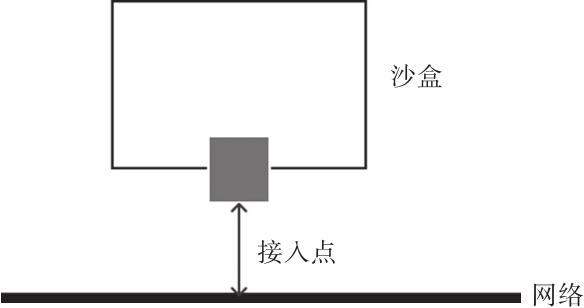

# libnetwork

容器网络项目，解耦容器和网络功能

## 容器网络模型

Container Networking Model，CNM

容器网络模型包括三种基本元素：

- 沙盒（Sandbox）：代表一个容器（准确地说，是其网络命名空间）；
- 接入点（Endpoint）：代表网络上可以挂载容器的接口，会分配 IP 地址；
- 网络（Network）：可以连通多个接入点的一个子网。

CNM 的典型生命周期：首先，驱动注册自己到网络控制器，网络控制器使用驱动类型，来创建网络；然后在创建的网络上创建接口；最后把容器连接到接口上即可。销毁过程则正好相反，先把容器从接入口上卸载，然后删除接入口和网络即可。

CNM 支持的驱动类型有四种：

- Null：不提供网络服务，容器启动后无网络连接；
- Bridge：就是 Docker 传统上默认用 Linux 网桥和 Iptables 实现的单机网络；
- Overlay：是用 vxlan 隧道实现的跨主机容器网络；
- Remote：扩展类型，预留给其他外部实现的方案，比如有一套第三方的 SDN 方案（如 OpenStack Neutron）就可以接进来。

## [Docker 网络命令](https://docs.docker.com/engine/reference/commandline/network/)

在 libnetwork 支持下，Docker 网络相关操作都作为 network 的子命令出现。

围绕着 CNM 生命周期的管理，主要包括以下命令：

- [create](https://docs.docker.com/engine/reference/commandline/network_create/)：`docker network create [OPTIONS] NETWORK`创建一个网络；
- connect：`docker network connect [OPTIONS] NETWORK CONTAINER`将容器接入到网络；
- disconnect：`docker network disconnect [OPTIONS] NETWORK CONTAINER`把容器从网络上断开；
- inspect：`docker network inspect [OPTIONS] NETWORK [NETWORK...]`查看网络的详细信息。
- ls：`docker network ls [OPTIONS]`列出所有的网络；
- prune：`docker network prune [OPTIONS]`清理无用的网络资源；
- rm：`docker network rm NETWORK [NETWORK...]`删除一个网络。
