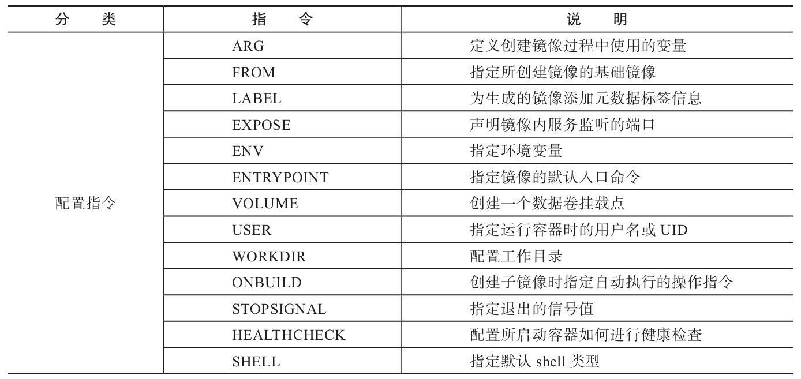
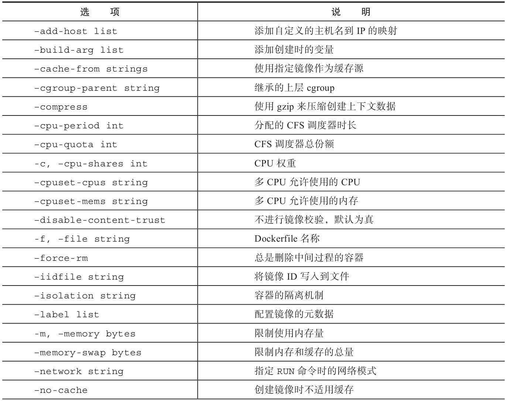
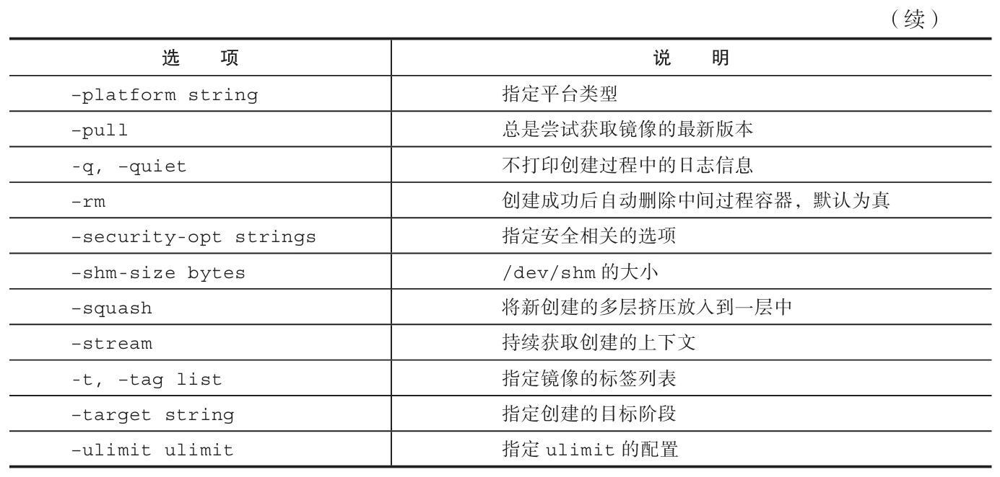
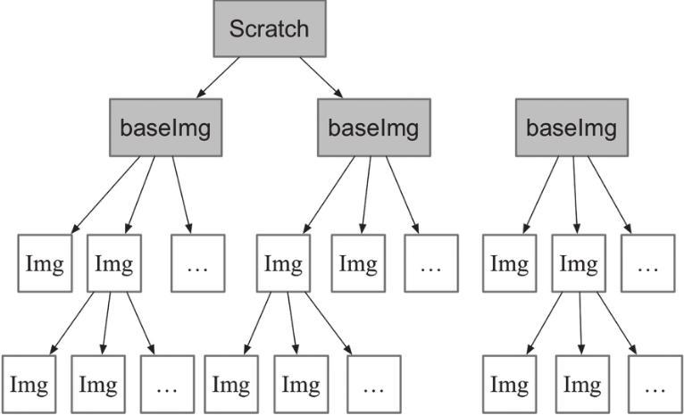

# [Dockerfile](https://docs.docker.com/engine/reference/builder/) 文件

Dockerfile ，一个文本格式的配置文件，用来配置 image。Docker 根据该文件生成二进制的 image 文件。

## 基本结构

Dockerfile 由一行行命令语句组成，并且支持以#开头的注释行。

Dockerfile 主体内容分为四部分：基础镜像信息、维护者信息、镜像操作指令和容器启动时执行指令。

主体部分首先使用 FROM 指令指明所基于的镜像名称，接下来一般是使用 LABEL 指令说明维护者信息。后面则是镜像操作指令，例如 RUN 指令将对镜像执行跟随的命令。每运行一条 RUN 指令，镜像添加新的一层，并提交。最后是 CMD 指令，来指定运行容器时的操作命令。

## 配置命令



- [ARG](https://docs.docker.com/engine/reference/builder/#arg)

  `ARG <name>[=<default value>]`定义创建镜像过程中使用的变量。
  在执行 `docker build` 时，可以通过`-build-arg[=]`来为变量赋值。当镜像编译成功后，ARG 指定的变量将不再存在（ENV 指定的变量将在镜像中保留）。

  Docker 内置了一些镜像创建变量，用户可以直接使用而无须声明，包括（不区分大小写）HTTP_PROXY、HTTPS_PROXY、FTP_PROXY、NO_PROXY。

- [FROM](https://docs.docker.com/engine/reference/builder/#from)

  `FROM <image> [AS <name>]`Or`FROM <image>[:<tag>] [AS <name>]`Or`FROM <image>[@<digest>] [AS <name>]`指定所创建镜像的基础镜像。

  任何 Dockerfile 中第一条指令必须为 FROM 指令。并且，如果在同一个 Dockerfile 中创建多个镜像时，可以使用多个 FROM 指令（每个镜像一次）。

- [LABEL](https://docs.docker.com/engine/reference/builder/#label)

  `LABEL <key>=<value> <key>=<value> <key>=<value> ...` LABEL 指令可以为生成的镜像添加元数据标签信息。这些信息可以用来辅助过滤出特定镜像。

- EXPOSE

  `EXPOSE <port> [<port>/<protocol>...]`声明镜像内服务监听的端口。

- ENV

  ```conf
  ENV <key> <value>
  ENV <key>=<value> ...
  ```

  指定环境变量，在镜像生成过程中会被后续 RUN 指令使用，在镜像启动的容器中也会存在。

  `docker run --env <key>=<value>.`指令指定的环境变量在运行时可以被覆盖掉

- ENTRYPOINT

  指定镜像的默认入口命令，该入口命令会在启动容器时作为根命令执行，所有传入值作为该命令的参数。

  ```conf
  ENTRYPOINT ["executable", "param1", "param2"] (exec form, preferred)
  ENTRYPOINT command param1 param2 (shell form)
  ```

  每个 Dockerfile 中只能有一个 ENTRYPOINT，当指定多个时，只有最后一个起效。

  在运行时，可以被--entrypoint 参数覆盖掉

- VOLUME

  创建一个数据卷挂载点。

  `VOLUME[「/data」]`

  运行容器时可以从本地主机或其他容器挂载数据卷，一般用来存放数据库和需要保持的数据等。

- USER

  指定运行容器时的用户名或 UID，后续的 RUN 等指令也会使用指定的用户身份。

  `USER daemon`

- WORKDIR

  为后续的 RUN、CMD、ENTRYPOINT 指令配置工作目录。

  `WORKDIR /path/to/workdir`

- ONBUILD

  当基于所生成镜像创建子镜像时，自动执行的操作指令。

  `ONBUILD [INSTRUCTION]`

- STOPSIGNAL

  指定所创建镜像启动的容器接收退出的信号值：

  `STOPSIGNAL signal`

为了保证镜像精简，可以选用体积较小的镜像如 Alpine 或 Debian 作为基础镜像。

## 操作指令

- RUN

  运行指定命令。当命令较长时可以使用`\`来换行。

  ```conf
  RUN <command> (shell form, the command is run in a shell, which by default is /bin/sh -c on Linux or cmd /S /C on Windows)
  #指令会被解析为 JSON 数组，必须用双引号
  RUN ["executable", "param1", "param2"] (exec form)
  ```

- CMD

  CMD 指令用来指定启动容器时默认执行的命令。

  ```conf
  CMD ["executable","param1","param2"] (exec form, this is the preferred form)
  CMD ["param1","param2"] (as default parameters to ENTRYPOINT)
  CMD command param1 param2 (shell form)
  ```

  每个 Dockerfile 只能有一条 CMD 命令。如果指定了多条命令，只有最后一条会被执行。

  如果用户启动容器时候手动指定了运行的命令（作为 run 命令的参数），则会覆盖掉 CMD 指定的命令。

- ADD

  添加内容到镜像。

  ```conf
  ADD [--chown=<user>:<group>] <src>... <dest>
  ADD [--chown=<user>:<group>] ["<src>",... "<dest>"] (this form is required for paths containing whitespace)
  ```

- COPY

  复制内容到镜像。

  `COPY [--chown=<user>:<group>] <src>... <dest>`

  复制本地主机的 `<src>`（为 Dockerfile 所在目录的相对路径，文件或目录）下内容到镜像中的 `<dest>`。目标路径不存在时，会自动创建。

  COPY 与 ADD 指令功能类似，当使用本地目录为源目录时，推荐使用 COPY。

## 创建镜像

编写完成 Dockerfile 之后，可以通过 docker build 命令来创建镜像。

`docker build [OPTIONS]PATH|URL|-`。




该命令将读取指定路径下（包括子目录）的 Dockerfile，并将该路径下所有数据作为上下文（Context）发送给 Docker 服务端。Docker 服务端在校验 Dockerfile 格式通过后，逐条执行其中定义的指令，碰到 ADD、COPY 和 RUN 指令会生成一层新的镜像。最终如果创建镜像成功，会返回最终镜像的 ID。

如果上下文过大，会导致发送大量数据给服务端，延缓创建过程。因此除非是生成镜像所必需的文件，不然不要放到上下文路径下。如果使用非上下文路径下的 Dockerfile，可以通过-f 选项来指定其路径。

要指定生成镜像的标签信息，可以通过-t 选项。该选项可以重复使用多次为镜像一次添加多个名称。

### 父镜像

一种是所谓的基础镜像（baseimage），另外一种是普通的镜像（往往由第三方创建，基于基础镜像）。


### `.dockerignore` 文件

可以通过.dockerignore 文件（每一行添加一条匹配模式）来让 Docker 忽略匹配路径或文件，在创建镜像时候不将无关数据发送到服务端。

### 多步骤镜像创建（Multi-stage build）

可以精简最终生成的镜像大小。

对于需要编译的应用（如 C、Go 或 Java 语言等）来说，通常情况下至少需要准备两个环境的 Docker 镜像：

- 编译环境镜像：包括完整的编译引擎、依赖库等，往往比较庞大。作用是编译应用为二进制文件；
- 运行环境镜像：利用编译好的二进制文件，运行应用，由于不需要编译环境，体积比较小。

使用多步骤创建，可以在保证最终生成的运行环境镜像保持精简的情况下，使用单一的 Dockerfile，降低维护复杂度。

```golang
// main.go will output "Hello, Docker"
package main
import (
    "fmt"
)
func main() {
    fmt.Println("Hello, Docker")
}
```

```dockerfile
# define stage name as builder
FROM golang:1.9 as builder
RUN mkdir -p /go/src/test
WORKDIR /go/src/test
COPY main.go .
RUN CGO_ENABLED=0 GOOS=linux go build -o app .
FROM alpine:latest
RUN apk --no-cache add ca-certificates
WORKDIR /root/
# copy file from the builder stage
COPY --from=builder /go/src/test/app .
CMD ["./app"]
```

```bash
$ docker build -t yeasy/test-multistage:latest .
Sending build context to Docker daemon  3.072kB
Step 1/10 : FROM golang:1.9
...
Successfully built 5fd0cb93dda0
Successfully tagged yeasy/test-multistage:latest
$ docker run --rm yeasy/test-multistage:latest
Hello, Docker
```

## 最佳实践

- 精简镜像用途：尽量让每个镜像的用途都比较集中单一，避免构造大而复杂、多功能的镜像；
- 选用合适的基础镜像：容器的核心是应用。选择过大的父镜像（如 Ubuntu 系统镜像）会造成最终生成应用镜像的臃肿，推荐选用瘦身过的应用镜像（如 node：slim），或者较为小巧的系统镜像（如 alpine、busybox 或 debian）；
- 提供注释和维护者信息：Dockerfile 也是一种代码，需要考虑方便后续的扩展和他人的使用；
- 正确使用版本号：使用明确的版本号信息，如 1.0，2.0，而非依赖于默认的 latest。通过版本号可以避免环境不一致导致的问题；
- 减少镜像层数：如果希望所生成镜像的层数尽量少，则要尽量合并 RUN、ADD 和 COPY 指令。通常情况下，多个 RUN 指令可以合并为一条 RUN 指令；
- 恰当使用多步骤创建（17.05+ 版本支持）：通过多步骤创建，可以将编译和运行等过程分开，保证最终生成的镜像只包括运行应用所需要的最小化环境。当然，用户也可以通过分别构造编译镜像和运行镜像来达到类似的结果，但这种方式需要维护多个 Dockerfile。
- 使用.dockerignore 文件：使用它可以标记在执行 docker build 时忽略的路径和文件，避免发送不必要的数据内容，从而加快整个镜像创建过程。
- 及时删除临时文件和缓存文件：特别是在执行 apt-get 指令后，/var/cache/apt 下面会缓存了一些安装包；
- 提高生成速度：如合理使用 cache，减少内容目录下的文件，或使用.dockerignore 文件指定等；
- 调整合理的指令顺序：在开启 cache 的情况下，内容不变的指令尽量放在前面，这样可以尽量复用；
- 减少外部源的干扰：如果确实要从外部引入数据，需要指定持久的地址，并带版本信息等，让他人可以复用而不出错。

## 制作 Docker 容器

下面我以 [koa-demos](http://www.ruanyifeng.com/blog/2017/08/koa.html) 项目为例，介绍怎么写 Dockerfile 文件，实现让用户在 Docker 容器里面运行 Koa 框架。

作为准备工作，请先[下载源码](https://github.com/ruanyf/koa-demos/archive/master.zip)。

```bash
$ git clone https://github.com/ruanyf/koa-demos.git
$ cd koa-demos
```

### 编写 Dockerfile 文件

首先，在项目的根目录下，新建一个文本文件`.dockerignore`，写入下面的[内容](https://github.com/ruanyf/koa-demos/blob/master/.dockerignore)。

```bash
.git
node_modules
npm-debug.log
```

上面代码表示，这三个路径要排除，不要打包进入 image 文件。如果你没有路径要排除，这个文件可以不新建。

然后，在项目的根目录下，新建一个文本文件 Dockerfile，写入下面的[内容](https://github.com/ruanyf/koa-demos/blob/master/Dockerfile)。

```bash
FROM node:8.4
COPY . /app
WORKDIR /app
RUN npm install --registry=https://registry.npm.taobao.org
EXPOSE 3000
```

上面代码一共五行，含义如下。

- `FROM node:8.4`：该 image 文件继承官方的 node image，冒号表示标签，这里标签是`8.4`，即 8.4 版本的 node。
- `COPY . /app`：将当前目录下的所有文件（除了`.dockerignore`排除的路径），都拷贝进入 image 文件的`/app`目录。
- `WORKDIR /app`：指定接下来的工作路径为`/app`。
- `RUN npm install`：在`/app`目录下，运行`npm install`命令安装依赖。注意，安装后所有的依赖，都将打包进入 image 文件。
- `EXPOSE 3000`：将容器 3000 端口暴露出来， 允许外部连接这个端口。

### 创建 image 文件

有了 Dockerfile 文件以后，就可以使用`docker image build`命令创建 image 文件了。

```bash
$ docker image build -t koa-demo .
# 或者
$ docker image build -t koa-demo:0.0.1 .
```

上面代码中，`-t`参数用来指定 image 文件的名字，后面还可以用冒号指定标签。如果不指定，默认的标签就是`latest`。最后的那个点表示 Dockerfile 文件所在的路径，上例是当前路径，所以是一个点。

如果运行成功，就可以看到新生成的 image 文件`koa-demo`了。

```bash
$ docker image ls
```

### 生成容器

`docker container run`命令会从 image 文件生成容器。

```bash
$ docker container run -p 8000:3000 -it koa-demo /bin/bash
# 或者
$ docker container run -p 8000:3000 -it koa-demo:0.0.1 /bin/bash
```

上面命令的各个参数含义如下：

- `-p`参数：容器的 3000 端口映射到本机的 8000 端口。
- `-it`参数：容器的 Shell 映射到当前的 Shell，然后你在本机窗口输入的命令，就会传入容器。
- `koa-demo:0.0.1`：image 文件的名字（如果有标签，还需要提供标签，默认是 latest 标签）。
- `/bin/bash`：容器启动以后，内部第一个执行的命令。这里是启动 Bash，保证用户可以使用 Shell。

如果一切正常，运行上面的命令以后，就会返回一个命令行提示符。

```bash
root@66d80f4aaf1e:/app#
```

这表示你已经在容器里面了，返回的提示符就是容器内部的 Shell 提示符。执行下面的命令。

```bash
root@66d80f4aaf1e:/app# node demos/01.js
```

这时，Koa 框架已经运行起来了。打开本机的浏览器，访问 `http://127.0.0.1:8000`，网页显示"Not Found"，这是因为这个 [demo](https://github.com/ruanyf/koa-demos/blob/master/demos/01.js)没有写路由。

这个例子中，Node 进程运行在 Docker 容器的虚拟环境里面，进程接触到的文件系统和网络接口都是虚拟的，与本机的文件系统和网络接口是隔离的，因此需要定义容器与物理机的端口映射（map）。

现在，在容器的命令行，按下 Ctrl + c 停止 Node 进程，然后按下 Ctrl + d （或者输入 exit）退出容器。此外，也可以用`docker container kill`终止容器运行。

```bash
# 在本机的另一个终端窗口，查出容器的 ID
$ docker container ls

# 停止指定的容器运行
$ docker container kill [containerID]
```

容器停止运行之后，并不会消失，用下面的命令删除容器文件。

```bash
# 查出容器的 ID
$ docker container ls --all

# 删除指定的容器文件
$ docker container rm [containerID]
```

也可以使用`docker container run`命令的`--rm`参数，在容器终止运行后自动删除容器文件。

```bash
$ docker container run --rm -p 8000:3000 -it koa-demo /bin/bash
```

### CMD 命令

上一节的例子里面，容器启动以后，需要手动输入命令`node demos/01.js`。我们可以把这个命令写在 Dockerfile 里面，这样容器启动以后，这个命令就已经执行了，不用再手动输入了。

```bash
FROM node:8.4
COPY . /app
WORKDIR /app
RUN npm install --registry=https://registry.npm.taobao.org
EXPOSE 3000
CMD node demos/01.js
```

上面的 Dockerfile 里面，多了最后一行`CMD node demos/01.js`，它表示容器启动后自动执行`node demos/01.js`。

你可能会问，`RUN`命令与`CMD`命令的区别在哪里？简单说，`RUN`命令在 image 文件的构建阶段执行，执行结果都会打包进入 image 文件；`CMD`命令则是在容器启动后执行。另外，一个 Dockerfile 可以包含多个`RUN`命令，但是只能有一个`CMD`命令。

注意，指定了`CMD`命令以后，`docker container run`命令就不能附加命令了（比如前面的`/bin/bash`），否则它会覆盖`CMD`命令。现在，启动容器可以使用下面的命令。

```bash
$ docker container run --rm -p 8000:3000 -it koa-demo:0.0.1
```

### 发布 image 文件

容器运行成功后，就确认了 image 文件的有效性。这时，我们就可以考虑把 image 文件分享到网上，让其他人使用。

首先，去 [hub.docker.com](https://hub.docker.com/) 或 [cloud.docker.com](https://cloud.docker.com/) 注册一个账户。然后，用下面的命令登录。

```bash
$ docker login
```

接着，为本地的 image 标注用户名和版本。

```bash
$ docker image tag [imageName] [username]/[repository]:[tag]
# 实例
$ docker image tag koa-demos:0.0.1 ruanyf/koa-demos:0.0.1
```

也可以不标注用户名，重新构建一下 image 文件。

```bash
$ docker image build -t [username]/[repository]:[tag] .
```

最后，发布 image 文件。

```bash
$ docker image push [username]/[repository]:[tag]
```

发布成功以后，登录 hub.docker.com，就可以看到已经发布的 image 文件。
