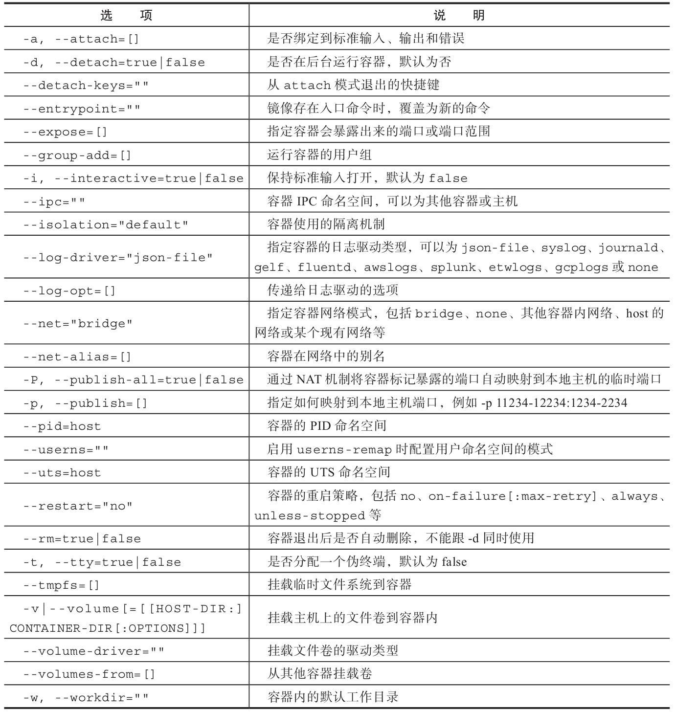
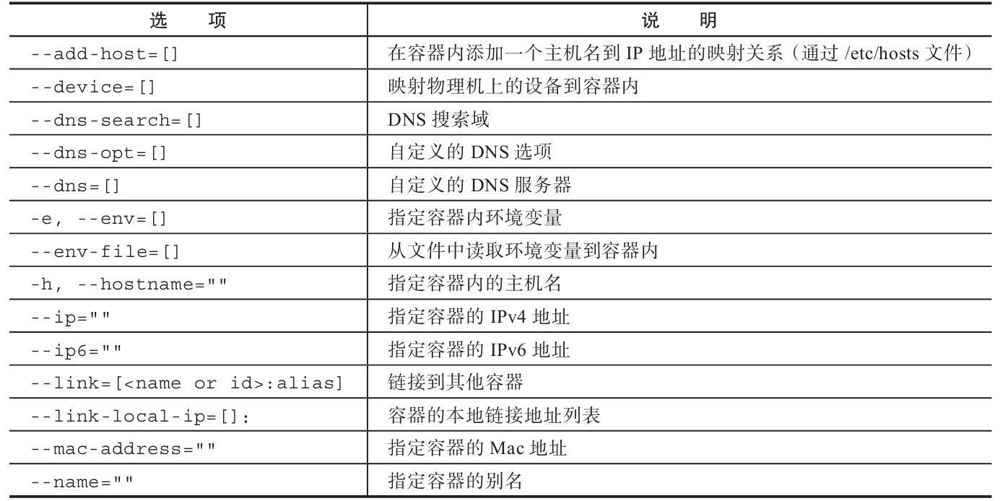
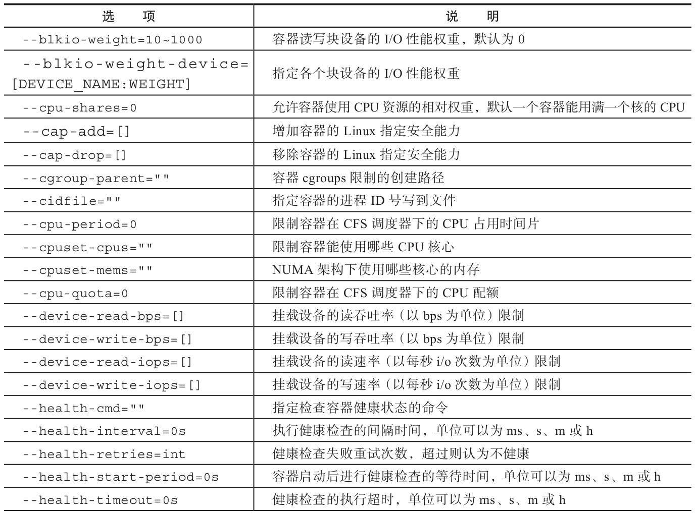
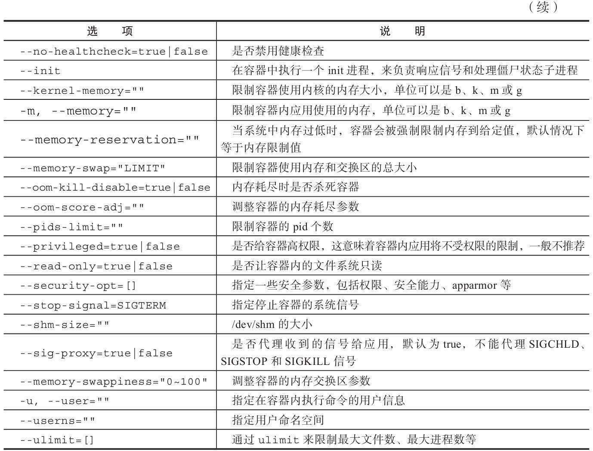

# 容器文件 Container

容器是镜像的一个运行实例。

**image 文件生成的容器实例，本身也是一个文件，称为容器文件。**也就是说，一旦容器生成，就会同时存在两个文件： image 文件和容器文件。而且关闭容器并不会删除容器文件，只是容器停止运行而已。

```bash
# 列出本机正在运行的容器
$ docker container ls

# 列出本机所有容器，包括终止运行的容器
$ docker container ls --all
```

上面命令的输出结果之中，包括容器的 ID。很多地方都需要提供这个 ID，比如终止容器运行的`docker container kill`命令。

终止运行的容器文件，依然会占据硬盘空间，可以使用[`docker container rm`](https://docs.docker.com/engine/reference/commandline/container_rm/)命令删除。

```bash
$ docker container rm [containerID]
```

运行上面的命令之后，再使用`docker container ls --all`命令，就会发现被删除的容器文件已经消失了。

每一个容器运行时，是以镜像为基础层，在其上创建一个当前容器的存储层，我们可以称这个为容器运行时读写而准备的存储层为容器存储层。

容器存储层的生存周期和容器一样，容器消亡时，容器存储层也随之消亡。因此，任何保存于容器存储层的信息都会随容器删除而丢失。

按照 Docker 最佳实践的要求，容器不应该向其存储层内写入任何数据，容器存储层要保持无状态化。所有的文件写入操作，都应该使用 数据卷（Volume）、或者绑定宿主目录，在这些位置的读写会跳过容器存储层，直接对宿主（或网络存储）发生读写，其性能和稳定性更高。

数据卷的生存周期独立于容器，容器消亡，数据卷不会消亡。因此，使用数据卷后，容器删除或者重新运行之后，数据却不会丢失。

## 运行容器

### [新建容器](https://docs.docker.com/engine/reference/commandline/container_create/)

`docker container create [OPTIONS] IMAGE [COMMAND] [ARG...]`新建一个容器






### [启动容器](https://docs.docker.com/engine/reference/commandline/container_start/)

`docker container start [OPTIONS] CONTAINER [CONTAINER...]`启动一个已经创建的容器

### [新建并启动容器](https://docs.docker.com/engine/reference/commandline/container_run/)

`docker container run [OPTIONS] IMAGE [COMMAND] [ARG...]`直接新建并启动容器。

Docker 在后台运行的标准操作包括：

- 检查本地是否存在指定的镜像，不存在就从公有仓库下载；
- 利用镜像创建一个容器，并启动该容器；
- 分配一个文件系统给容器，并在只读的镜像层外面挂载一层可读写层；
- 从宿主主机配置的网桥接口中桥接一个虚拟接口到容器中去；
- 从网桥的地址池配置一个 IP 地址给容器；
- 执行用户指定的应用程序；
- 执行完毕后容器被自动终止

启动一个 bash 终端，允许用户进行交互：

`$ docker run -it ubuntu:18.04 /bin/bash`

- -t 选项让 Docker 分配一个伪终端（pseudo-tty）并绑定到容器的标准输入上，
- -i 则让容器的标准输入保持打开。

常见容器退出的错误代码：

- 125：Docker daemon 执行出错，例如指定了不支持的 Docker 命令参数；
- 126：所指定命令无法执行，例如权限出错；
- 127：容器内命令无法找到。

#### 守护态运行

通过添加-d 参数让 Docker 容器在后台以守护态（Daemonized）形式运行。

`$ docker run -d ubuntu:18.04 /bin/sh`

容器启动后会返回一个唯一的 id

### [查看容器输出](https://docs.docker.com/engine/reference/commandline/container_logs/)

`docker container logs [OPTIONS] CONTAINER`获取容器的输出信息

## 停止容器

### [暂停容器](https://docs.docker.com/engine/reference/commandline/container_pause/)

`docker container pause CONTAINER [CONTAINER...]`暂停一个运行中的容器。

`docker container unpause CONTAINER [CONTAINER...]`恢复一个暂停中的容器。

### [终止容器](https://docs.docker.com/engine/reference/commandline/container_stop/)

`docker container stop [OPTIONS] CONTAINER [CONTAINER...]`终止一个运行中的容器。

该命令会首先向容器发送 SIGTERM 信号，等待一段超时时间后（默认为 10 秒），再发送 SIGKILL 信号来终止容器

[`docker container prune [OPTIONS]`](https://docs.docker.com/engine/reference/commandline/container_prune/)自动清除掉所有处于停止状态的容器。

[`docker container kill [OPTIONS] CONTAINER [CONTAINER...]`](https://docs.docker.com/engine/reference/commandline/container_kill/)直接发送 SIGKILL 信号来强行终止容器。

### [重新启动](https://docs.docker.com/engine/reference/commandline/container_start/)

`docker container start [OPTIONS] CONTAINER [CONTAINER...]`

## 进入容器

进入容器进行操作。

### [attach](https://docs.docker.com/engine/reference/commandline/container_attach/)

`docker container attach [OPTIONS] CONTAINER`

### [exec](https://docs.docker.com/engine/reference/commandline/container_exec/)

在运行中容器内直接执行任意命令。

`docker container exec [OPTIONS] CONTAINER COMMAND [ARG...]`

## [删除容器](https://docs.docker.com/engine/reference/commandline/container_rm/)

`docker container rm [OPTIONS] CONTAINER [CONTAINER...]`删除处于终止或退出状态的容器

## [导出容器](https://docs.docker.com/engine/reference/commandline/container_export/)

导出一个已经创建的容器到一个文件，不管此时这个容器是否处于运行状态。
`docker container export [OPTIONS] CONTAINER`

## [导入容器](https://docs.docker.com/engine/reference/commandline/import/)

`docker import [OPTIONS] file|URL|- [REPOSITORY[:TAG]]`

## 查看容器

### [查看容器详情](https://docs.docker.com/engine/reference/commandline/container_inspect/)

`docker container inspect [OPTIONS] CONTAINER [CONTAINER...]`

### [查看容器内进程](https://docs.docker.com/engine/reference/commandline/container_top/)

`docker container top CONTAINER [ps OPTIONS]`会打印出容器内的进程信息，包括 PID、用户、时间、命令等。

### [查看统计信息](https://docs.docker.com/engine/reference/commandline/container_stats/)

`docker container stats [OPTIONS] [CONTAINER...]`会打印出容器内的进程信息，包括 PID、用户、时间、命令等。
