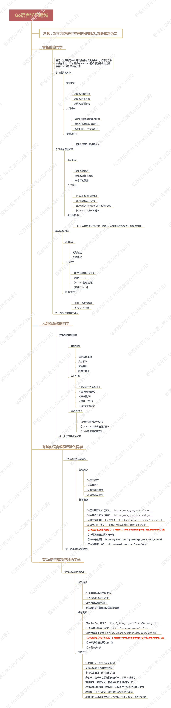

# go

Go 是一门编译型，具有静态类型和类 C 语言语法的语言，并且有垃圾回收（GC）机制。编译快，强类型，

Go 语言鼓励当代计算机系统设计的原则，特别是局部的重要性。它的内置数据类型和大多数的准库数据结构都经过精心设计而避免显式的初始化或隐式的构造函数，因为很少的内存分配和内存初始化代码被隐藏在库代码中了。Go 语言的聚合类型（结构体和数组）可以直接操作它们的元素，只需要更少的存储空间、更少的内存写操作，而且指针操作比其他间接操作的语言也更有效率。由于现代计算机是一个并行的机器，Go 语言提供了基于 CSP 的并发特性支持。Go 语言的动态栈使得轻量级线程 goroutine 的初始栈可以很小，因此，创建一个 goroutine 的代价很小，创建百万级的 goroutine 完全是可行的。

Go 语言的标准库（通常被称为语言自带的电池），提供了清晰的构建模块和公共接口，包含 I/O 操作、文本处理、图像、密码学、网络和分布式应用程序等，并支持许多标准化的文件格式和编解码协议。库和工具使用了大量的约定来减少额外的配置和解释，从而最终简化程序的逻辑，而且，每个 Go 程序结构都是如此的相似，因此，Go 程序也很容易学习。使用 Go 语言自带工具构建 Go 语言项目只需要使用文件名和标识符名称, 一个偶尔的特殊注释来确定所有的库、可执行文件、测试、基准测试、例子、以及特定于平台的变量、项目的文档等；Go 语言源代码本身就包含了构建规范。

## 结构

- api：用于存放依照`Go`版本顺序的 API 增量列表文件。这里所说的 API 包含公开的变量、常量、函数等。这些 API 增量列表文件用于`Go`语言 API 检查
- bin：用于存放主要的标准命令文件（可执行文件），包含`go`、`godoc`、`gofmt`
- blog：用于存放官方博客中的所有文章
- doc：用于存放标准库的 HTML 格式的程序文档。我们可以通过`godoc`命令启动一个 Web 程序展示这些文档
- lib：用于存放一些特殊的库文件
- misc：用于存放一些辅助类的说明和工具
- pkg：用于存放安装`Go`标准库后的所有归档文件（以`.a`结尾的文件）。注意，你会发现其中有名称为`linux_amd64`的文件夹，我们称为平台相关目录。这类文件夹的名称由对应的操作系统和计算架构的名称组合而成。通过`go install`命令，`Go`程序会被编译成平台相关的归档文件存放到其中
- src：用于存放`Go`自身、`Go`标准工具以及标准库的所有源码文件
- test：存放用来测试喝验证`Go`本身的所有相关文件

## 命名

一个名字必须以一个字母（Unicode 字母）或下划线开头，后面可以跟任意数量的字母、数字或下划线。

如果一个名字是在函数内部定义，那么它就只在函数内部有效。如果是在函数外部定义，那么将在当前包的所有文件中都可以访问。名字的开头字母的大小写决定了名字在包外的可见性。如果一个名字是大写字母开头的（译注：必须是在函数外部定义的包级名字；包级函数名本身也是包级名字），那么它将是导出的，也就是说可以被外部的包访问，例如 fmt 包的 Printf 函数就是导出的，可以在 fmt 包外部访问。包本身的名字一般总是用小写字母。

名字的长度没有逻辑限制，但是 Go 语言的风格是尽量使用短小的名字，对于局部变量尤其是这样。通常来说，如果一个名字的作用域比较大，生命周期也比较长，那么用长的名字将会更有意义。

在习惯上，Go 语言程序员推荐使用 **驼峰式** 命名，当名字由几个单词组成时优先使用大小写分隔，而不是优先用下划线分隔。因此，在标准库有 QuoteRuneToASCII 和 parseRequestLine 这样的函数命名，但是一般不会用 quote_rune_to_ASCII 和 parse_request_line 这样的命名。而像 ASCII 和 HTML 这样的缩略词则避免使用大小写混合的写法，它们可能被称为 htmlEscape、HTMLEscape 或 escapeHTML，但不会是 escapeHtml。

## go 学习路径



[Go 开发者路线图](https://github.com/Quorafind/golang-developer-roadmap-cn)

## go 知识点


## godoc

本地获取文档：

```bash
godoc -http=:6060
```

然后浏览器中访问 `http://localhost:6060`

## [go tour](https://tour.go-zh.org/welcome/3)

用 [go get](https://go-zh.org/cmd/go/) 命令来安装[gotour](https://go-zh.org/x/tour/): `go get github.com/Go-zh/tour/gotour` 最后运行产生的 `gotour` 可执行文件。 如果要运行本教程的英文版，首先请[下载并安装 Go](https://golang.org/dl/)，接着从命令行启动教程： `go tool tour`

## vscode

[VS Code 中的代码自动补全和自动导入包](https://maiyang.me/post/2018-09-14-tips-vscode/)

## mirrors

### [阿里云](https://mirrors.aliyun.com/goproxy/)

`export GOPROXY=https://mirrors.aliyun.com/goproxy/`

### [七牛云](https://github.com/goproxy/goproxy.cn/blob/master/README.zh-CN.md#%E7%94%A8%E6%B3%95)

`export GOPROXY=https://goproxy.cn`

## [goimports](https://www.jianshu.com/p/8719bf5aeca0)

使用`go get golang.org/x/tools/cmd/goimports`

如果没有翻墙的话，获取不到。国内需要翻墙才可以从 golang.org 获取到。
GitHub 上获取：

```bash
go get -v github.com/gpmgo/gopm
```

gopm 获取完成后需要获取 goimports：

```bash
gopm get -g -v golang.org/x/tools/cmd/goimports
```

install goimports

```bash
cd $GOPATH/src/golang.org/x/tools/cmd/goimports
go install
```

## 目录

- [常量](const.md)
- [defer 延迟](defer.md)
- [函数](func.md)
- [go 程](goroutine.md)
- [流程控制](loop-control.md)
- [包](package/README.md)
- [指针](pointer.md)
- [切片](slice.md)
- [结构体](struct.md)
- [变量](var.md)

## 参考

- [Go 指南](https://tour.go-zh.org/list)
- [Go 语言核心 36 讲](https://time.geekbang.org/column/112)
- [Golang 微服务框架 micro](https://micro.mu/docs/)
- [正则参考](https://github.com/google/re2/wiki/Syntax)
- [编写和优化 Go 代码](https://github.com/dgryski/go-perfbook/blob/master/performance-zh.md)
