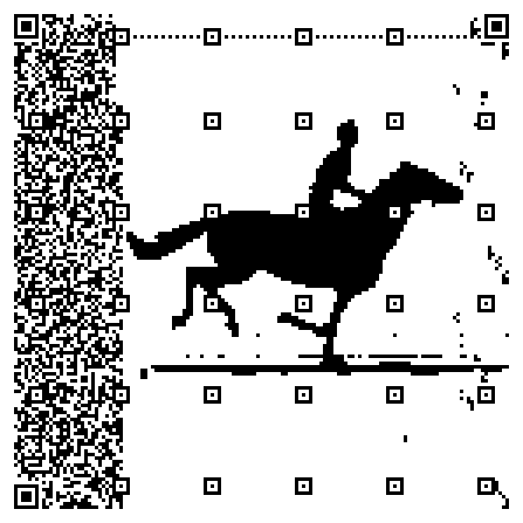

# 二维码扫码登录是什么原理

前几天看了[极客时间一个二维码的视频](https://time.geekbang.org/dailylesson/detail/100044032?utm_source=u_nav_web&utm_medium=u_nav_web&utm_term=u_nav_web)，写的不错，这里总结下

在日常生活中，二维码出现在很多场景，比如超市支付、系统登录、应用下载等等。了解二维码的原理，可以为技术人员在技术选型时提供新的思路。对于非技术人员呢，除了解惑，还可以引导他更好地辨别生活中遇到的各种二维码，防止上当受骗。

二维码，大家再熟悉不过了

购物扫个码，吃饭扫个码，坐公交也扫个码


在扫码的过程中，大家可能会有疑问：这二维码安全吗？会不会泄漏我的个人信息？更深度的用户还会考虑：我的系统是不是也可以搞一个二维码来推广呢？

这时候就需要了解一下二维码背后的技术和逻辑了！

二维码最常用的场景之一就是通过手机端应用扫描PC或者WEB端的二维码，来登录同一个系统。 比如手机微信扫码登录PC端微信，手机淘宝扫码登录PC端淘宝。 那么就让我们来看一下，二维码登录是怎么操作的！

## 二维码登录的本质

二维码登录本质上也是一种登录认证方式。既然是登录认证，要做的也就两件事情！

1. 告诉系统我是谁
2. 向系统证明我是谁

比如账号密码登录，账号就是告诉系统我是谁， 密码就是向系统证明我是谁; 比如手机验证码登录，手机号就是告诉系统我是谁，验证码就是向系统证明我是谁;

那么扫码登录是怎么做到这两件事情的呢？我们一起来考虑一下

手机端应用扫PC端二维码，手机端确认后，账号就在PC端登录成功了！这里，PC端登录的账号肯定与手机端是同一个账号。不可能手机端登录的是账号A，而扫码登录以后，PC端登录的是账号B。

所以，第一件事情，告诉系统我是谁，是比较清楚的！

通过扫描二维码，把手机端的账号信息传递到PC端，至于是怎么传的，我们后面再说

第二件事情，向系统证明我是谁。扫码登录过程中，用户并没有去输入密码，也没有输入验证码，或者其他什么码。那是怎么证明的呢？

有些同学会想到，是不是扫码过程中，把密码传到了PC端呢？ 但这是不可能的。因为那样太不安全的，客户端也根本不会去存储密码。我们仔细想一下，其实手机端APP它是已经登录过的，就是说手机端是已经通过登录认证。所说只要**扫码确认是这个手机且是这个账号操作的，其实就能间接证明我谁。**

## 认识二维码

那么如何做确认呢？我们后面会详细说明，在这之前我们需要先认识一下二维码！ 在认识二维码之前我们先看一下一维码！


所谓一维码，也就是条形码，超市里的条形码--这个相信大家都非常熟悉，条形码实际上就是一串数字，它上面存储了商品的序列号。

二维码其实与条形码类似，只不过它存储的不一定是数字，还可以是任何的字符串，你可以认为，它就是字符串的另外一种表现形式，

在搜索引擎中搜索二维码，你可以找到很多在线生成二维码的工具网站，这些网站可以提供字符串与二维码之间相互转换的功能，比如 [草料二维码网站](https://cli.im/)


在左边的输入框就可以输入你的内容，它可以是文本、网址，文件........。然后就可以生成代表它们的二维码

你也可以把二维码上传，进行”解码“，然后就可以解析出二维码代表的含义

## 系统认证机制

认识了二维码，我们了解一下移动互联网下的系统认证机制。

前面我们说过，为了安全，手机端它是不会存储你的登录密码的。 但是在日常使用过程中，我们应该会注意到，只有在你的应用下载下来后，第一次登录的时候，才需要进行一个账号密码的登录， 那之后呢 即使这个应用进程被杀掉，或者手机重启，都是不需要再次输入账号密码的，它可以自动登录。

其实这背后就是一套基于token的认证机制，我们来看一下这套机制是怎么运行的，


1. 账号密码登录时，客户端会将设备信息一起传递给服务端，
2. 如果账号密码校验通过，服务端会把账号与设备进行一个绑定，存在一个数据结构中，这个数据结构中包含了账号ID，设备ID，设备类型等等

```javascript
const token = {
  acountid:'账号ID',
  deviceid:'登录的设备ID',
  deviceType:'设备类型，如 iso,android,pc......',
}
复制代码
```

然后服务端会生成一个token，用它来映射数据结构，这个token其实就是一串有着特殊意义的字符串，它的意义就在于，通过它可以找到对应的账号与设备信息，

1. 客户端得到这个token后，需要进行一个本地保存，每次访问系统API都携带上token与设备信息。
2. 服务端就可以通过token找到与它绑定的账号与设备信息，然后把绑定的设备信息与客户端每次传来的设备信息进行比较， 如果相同，那么校验通过，返回AP接口响应数据， 如果不同，那就是校验不通过拒绝访问

从前面这个流程，我们可以看到，客户端不会也没必要保存你的密码，相反，它是保存了token。可能有些同学会想，这个token这么重要，万一被别人知道了怎么办。实际上，知道了也没有影响， 因为设备信息是唯一的，只要你的设备信息别人不知道， 别人拿其他设备来访问，验证也是不通过的。

可以说，客户端登录的目的，就是获得属于自己的token。

那么在扫码登录过程中，PC端是怎么获得属于自己的token呢？不可能手机端直接把自己的token给PC端用！token只能属于某个客户端私有，其他人或者是其他客户端是用不了的。在分析这个问题之前，我们有必要先梳理一下，扫描二维码登录的一般步骤是什么样的。这可以帮助我们梳理清楚整个过程，

## 扫描二维码登录的一般步骤

### 大概流程


1. 扫码前，手机端应用是已登录状态，PC端显示一个二维码，等待扫描
2. 手机端打开应用，扫描PC端的二维码，扫描后，会提示"已扫描，请在手机端点击确认"
3. 用户在手机端点击确认，确认后PC端登录就成功了

可以看到，二维码在中间有三个状态， 待扫描，已扫描待确认，已确认。 那么可以想象


1. 二维码的背后它一定存在一个唯一性的ID，当二维码生成时，这个ID也一起生成，并且绑定了PC端的设备信息
2. 手机去扫描这个二维码
3. 二维码切换为 已扫描待确认状态， 此时就会将账号信息与这个ID绑定
4. 当手机端确认登录时，它就会生成PC端用于登录的token，并返回给PC端

好了，到这里，基本思路就已经清晰了，接下来我们把整个过程再具体化一下

### 二维码准备

按二维码不同状态来看， 首先是等待扫描状态，用户打开PC端，切换到二维码登录界面时。


1. PC端向服务端发起请求，告诉服务端，我要生成用户登录的二维码，并且把PC端设备信息也传递给服务端
2. 服务端收到请求后，它生成二维码ID，并将二维码ID与PC端设备信息进行绑定
3. 然后把二维码ID返回给PC端
4. PC端收到二维码ID后，生成二维码(二维码中肯定包含了ID)
5. 为了及时知道二维码的状态，客户端在展现二维码后，PC端不断的轮询服务端，比如每隔一秒就轮询一次，请求服务端告诉当前二维码的状态及相关信息

二维码已经准好了，接下来就是扫描状态

### 扫描状态切换


1. 用户用手机去扫描PC端的二维码，通过二维码内容取到其中的二维码ID
2. 再调用服务端API将移动端的身份信息与二维码ID一起发送给服务端
3. 服务端接收到后，它可以将身份信息与二维码ID进行绑定，生成临时token。然后返回给手机端
4. 因为PC端一直在轮询二维码状态，所以这时候二维码状态发生了改变，它就可以在界面上把二维码状态更新为已扫描

那么为什么需要返回给手机端一个临时token呢？临时token与token一样，它也是一种身份凭证，不同的地方在于它只能用一次，用过就失效。

在第三步骤中返回临时token，为的就是手机端在下一步操作时，可以用它作为凭证。以此确保扫码，登录两步操作是同一部手机端发出的，

### 状态确认

最后就是状态的确认了。


1. 手机端在接收到临时token后会弹出确认登录界面，用户点击确认时，手机端携带临时token用来调用服务端的接口，告诉服务端，我已经确认
2. 服务端收到确认后，根据二维码ID绑定的设备信息与账号信息，生成用户PC端登录的token
3. 这时候PC端的轮询接口，它就可以得知二维码的状态已经变成了"已确认"。并且从服务端可以获取到用户登录的token
4. 到这里，登录就成功了，后端PC端就可以用token去访问服务端的资源了

扫码动作的基础流程都讲完了，有些细节还没有深入介绍，

比如二维码的内容是什么？

- 可以是二维码ID
- 可以是包含二维码ID的一个url地址

在扫码确认这一步，用户取消了怎么处理？ 这些细节都留给大家思考

## 总结


我们从登陆的本质触发，探索二维码扫码登录是如何做到的

1. 告诉系统我是谁
2. 向系统证明我谁

在这个过程中，我们先简单讲了两个前提知识，

- 一个是二维码原理，
- 一个是基于token的认证机制。

然后我们以二维码状态为轴，分析了这背后的逻辑: 通过token认证机制与二维码状态变化来实现扫码登录.

需要指出的是，前面的讲的登录流程，它适用于同一个系统的PC端，WEB端，移动端。

平时我们还有另外一种场景也比较常见，那就是通过第三方应用来扫码登录，比如极客时间/掘金 都可以选择微信/QQ等扫码登录，那么这种通过第三方应用扫码登录又是什么原理呢？


### **Matrix 首页推荐**

[Matrix](https://sspai.com/matrix) 是少数派的写作社区，我们主张分享真实的产品体验，有实用价值的经验与思考。我们会不定期挑选 Matrix 最优质的文章，展示来自用户的最真实的体验和观点。

文章代表作者个人观点，少数派仅对标题和排版略作修改。

翻译已得到原作者（[Marien Raat](https://marienraat.nl/index.html)）授权，原文发表在 Marien Raat 的博客上（[链接](https://marienraat.nl/hacking-qr-codes.html)）。

------

让我们看看如何在不让链接失效的前提下随心所欲地更改二维码的外观。我们还会展示世界上第一个（据我所知）可以正常使用的动态二维码。

来 [My-QR.art](https://my-qr.art/) 看看效果怎么样吧！

二维码是将现实世界和数字世界连通的一种简单可行的方式。每当我看到一个二维码，我都会想扫一扫，看看它后面隐藏了什么东西，二维码就是这样让我着迷。但是二维码看起来总是千篇一律，有没有什么办法能让他们看起来更炫酷一点呢？比如说，能不能把二维码做成某个特定的形状，或者做成像素画的样子呢？

人们已经利用了（或者说是滥用了）二维码的纠错功能来在二维码中添加他们的 logo：他们只需把自己的 logo 放在二维码的一部分上，并让纠错功能处理丢失的数据就好了。然而，如果你想用这种方式来修改二维码，你最多只能遮挡 30%（实际来讲通常会比这个数值小很多）的二维码面积。换个思路想的话，既然二维码本质上就是数据的一种可视化形式，我们能不能换一种角度来看这个问题呢？比如说，我们不去思考如何设计二维码来让它适合我们的数据，而是让数据适合我们的二维码，这样可不可以呢？

先上结论：完全可以。看看 [My-QR.art](https://my-qr.art/) 就知道了。所有的代码都完全公开，当然也欢迎 [来 GitHub](https://github.com/raatmarien/my-qr.art) 提交代码。

## 思路

比如说，我们想要给我们的网站做一个推广。而且，我们现在正好有一个我们网站的黑白 logo。我们要做的就是去做一个引人注意的二维码，让它长得像我们网站的 logo。


当然，二维码所指向的网址我们也有，比如说这个：[https://my-qr.art](https://my-qr.art/)。

我们已经设置好了一台服务器，用来重定向特定的链接。这样之后，我们可以把二维码头部的数据设置成指向那台服务器的链接，于是二维码后面所表示的数据就可以由我们自己来定义了。因此，我们就可以自由设计这部分数据，来让二维码符合我们的设计了！

举个例子吧：二维码所指向的网址是 `https://my-qr.art/r/是什么都无所谓的一段超长字符串` ，在服务器后端我们可以告诉服务器，将任何指向 `https://my-qr.art/r/是什么都无所谓的一段超长字符串` 这个网址的请求都重定向到 `https://my-qr.art` 这里。于是，我们这就做好了一个能够正常使用的二维码：它既可以将我们带往指定的网址，同时又能对二维码的外观进行更多的自定义！多达 80% 的代码都可以用这种方式来编辑。

这些都搞定之后，就算是想做动态二维码也不在话下。我们可以独立制作每一帧，并让它们都重定向到同一个页面上。确实，打印出来的二维码占多数，所以动态二维码可能没什么意义，但它们看起来真的很酷！为了让你在接下来的阅读中不至于昏昏欲睡，先给你看一个世界上（据我所知）第一个可以正常工作的动态二维码：



[奔跑的马儿有没有让你想起某部电影……？](https://en.wikipedia.org/wiki/The_Horse_in_Motion)

## 二维码的工作原理是怎样的？

我们既然知道了思路，那就开始着手做吧。但首先，我们要弄清楚二维码的工作原理是什么样的。

二维码使其中的一部分方块变黑，一部分方块变白，以此来编码数据。这之后，二维码扫描器通过识别这些黑色和白色的小方块就可以复原其信息。二维码的尺寸多种多样，从版本 1（非常小，17×17）到版本 40（非常大，177 × 177），共有 40 种之多。二维码中黑白的小方块叫做「模块」，每一个模块都有以下这四种功能之一：

1. 帮助扫描器识别二维码，并辨别其朝向
2. 提供二维码的内部信息，例如二维码的大小，类型等
3. 对二维码所代表的实际数据进行编码
4. 对二维码的纠错信息进行编码

## 创建一个模板

在我们的计划中，用户可以决定所有实行功能 3 的模块的颜色。于是，第一点要做的就是让用户知道，在他们选定尺寸的二维码中，哪些像素用户可以控制，哪些不可以。我们先创建一个模板，让实行功能 3 的模块呈现白色，而其他模块全都呈现灰色。

这样，我们就可以自行为其他模块和纠错数据填充颜色了。为了做到这一步，你需要深入了解二维码的工作原理。我们需要考虑数据编码、数据交错（interleaving）、额外的识别点（extra eyes）、纠错信息（error words）等等。同时，我们也要考虑到我们需要为我们的链接预留前面的几个字符。

幸运的是，互联网上有这么一个很棒的资源：[Thonky.com 提供的二维码教程](https://www.thonky.com/qr-code-tutorial/introduction)。在一个版本 30 的二维码上处理了这些事情之后，我们就会得到这样的一张图片。


## 读取设计

现在我们来解决另一个问题：在用户在我们的模板上绘制了他自己的设计之后，我们要如何将其转换成可用的二维码？二维码有四种可用的编码类型：数字、字母数字、二进制和汉字。我们需要用编码来创建链接，所以数字和汉字这两种是不行的。其次，我们需要使链接结尾的随机字符串足够正常，这样二维码扫描器才会将我们的代码识别为一个链接。二进制编码方式通常会产生一些不会出现在链接中的字符组合（比如说「\0」），这就会导致许多二维码扫描器不会将其作为链接打开。


幸运的是，字母数字编码方式刚刚好有足够的字符来让我们创建可用的链接（尽管生成的字母只能是大写的）。

蛇形方式的读取顺序

弄明白这一点之后，我们来读取用户的设计吧。首先我们需要从设计中的所有数据模块中提取一个位串（bit string）。对于较小的二维码来说这一过程相当直接；只需要像 Thonky 提供的上图一样，从上到下，从右到左以蛇形方式读取即可。但是对于尺寸大于 5 的二维码来说，我们就要考虑到数据交错的问题了。在尺寸大于 5 的二维码中，数据信息散布在二维码的各处，也许这样做是为了让数据样式更加随机。所以，我们需要将这个交错程序逆转过来。

幸运的是，[Thonky.com](https://www.thonky.com/) 对于这一点也同样进行了解释。最后我们从我们的设计中提取出一个长达 13863 位长的位串，现在我们只展示前 80 个字符：

```
01100011010101001100101010001100011110111010100000000001110100111110011101001001
```

## 给位串解码

现在，我们需要将位串解码，使其变成一个字母数字串。我们按照每 11 位一组的方式对位串进行分组，并且按照 [这个表](https://www.thonky.com/qr-code-tutorial/alphanumeric-table) 来将其转化成 2 个字母/数字字符。我们得到的结果就是下面这样（同样是部分）：

```
KS$#LKAHRDF9H8XQI9AL HRD$OIWHSRE94QX95IFR*IK9HF/ 5NM+/AMIA99LB I5R II98ULR JRD/AR1 IRG8...
```

我们把前 20 位换成我们的链接前缀，之后就会得到：

```
HTTPS://MY-QR.ART/R/ HRD$OIWHSRE94QX95IFR*IK9HF/ 5NM+/AMIA99LB I5R II98ULR JRD/AR1 IRG8...
```

## 生成二维码

现在我们可以随便用个二维码库来生成二维码了！二维码库会帮我们处理纠错码以及其他无聊的部分。


但怎么生成了这样的东西？这看起来也不像图像呀？问题出在遮罩上。二维码规格中有五种不同的遮罩，其中这种使我们的二维码看起来最为随机化的是选择好的，为了让二维码扫描器更易阅读。但这肯定不是我们想要的效果。但是，以我的经验来说，扫描器扫描这些不随机的数据也没什么问题，所以即便把二维码库设置为总使用同一种遮罩，我们也不必太担心。我们先给我们的设计应用相同的遮罩，再进行处理，我们终于得到了我们想要的图像。


## 将请求重定向

现在我们要将二维码重定向到正确的域名上。这按理来说很简单：只要把二维码的网址放在数据库中，然后链接到重定向的网址就行了。当我们收到请求时，只需要在数据库中查找相应的网址即可。然而，如果我们想用现代的网络服务器，我们就还得兜几个圈子。Apache 不喜欢我们生成的大多数链接，因为它们看起来都不像正常的链接（这就不好玩了是不是，Apache？）。于是我们会收到一条错误信息：`Error 400: Bad request`。而且，似乎我们还没办法把这条错误信息关掉。

但幸运的是，有一个变通的办法：我们可以为我们的 Error 400 页面设置一个自定义的错误页面，所以如果我们把重定向页面设置为 Error 400 的错误页面，就搞定了！幸亏 Apache 没有扫兴到在处理 Bad Request 时再给我们一个 Bad Request 错误……

我的后端用的是 Django，处理这些乱七八糟的链接时，它还会出现另一个令人哭笑不得的 bug：它会尝试将链接作为一个 ISO-8859-1 的字符串来解码，但是 Apache 传过来的字符中有些不在 ISO-8859-1 中。这时，我们就需要我们自己的 WSGI 处理程序来解决这个问题了：[具体看这里](https://github.com/raatmarien/my-qr.art/blob/main/my_qr_art/custom_wsgi.py)。但现在所有问题总算是解决了，扫一扫我们创作的二维码，它成功地重定向到了我们想要的地方！

不过还是有一个小小的注意事项需要说明：二维码本身是标准化的，我们创建的是标准的二维码，其中包含正确的链接；但是二维码扫描器未必是标准化的，也就是说有的可能会将我们的二维码识别为文本，而不是链接。

## 人人都能设计自己的二维码！

因为处理图像什么的对用户来说不怎么友好，所以我用 Django 做了个网页应用，在 [My-QR.art](https://my-qr.art/) 这里。你可以使用这个易于上手的 [编辑器](https://my-qr.art/editor) 来画、填充、或者上传黑白图片来创建你自己的二维码。同时，它也有一些我们做的解释和重定向代码。项目本身完全免费开源，可以来  [GitHub 主页](https://github.com/raatmarien/my-qr.art) 查看详细信息。


## 写在最后

终于可以依据我们的意愿创建二维码了，怎一个爽字了得！快去 [My-QR.art](https://my-qr.art/) 创建你自己的二维码，或者去 [GitHub 主页](https://github.com/raatmarien/my-qr.art) 查看代码。觉得这个项目很酷，想要助力吗？和你的家人、朋友们分享这篇博客，网站，去 GitHub 上为这个项目打星标，都可以。如果您手头阔绰，若是能用网页下方的捐赠按钮表一份心意也是极好的，毕竟运营  [My-QR.art](https://my-qr.art/) 这个网站可不是免费的。同时，如果你用 [My-QR.art](https://my-qr.art/) 做出了酷炫的二维码，也欢迎[ 通过邮件](mailto:contact@marienraat.nl) 与我分享。


[译文｜魔改二维码 - 少数派 (sspai.com)](https://sspai.com/post/65997)

[二维码扫码登录是什么原理 (juejin.cn)](https://juejin.cn/post/6940976355097985032)