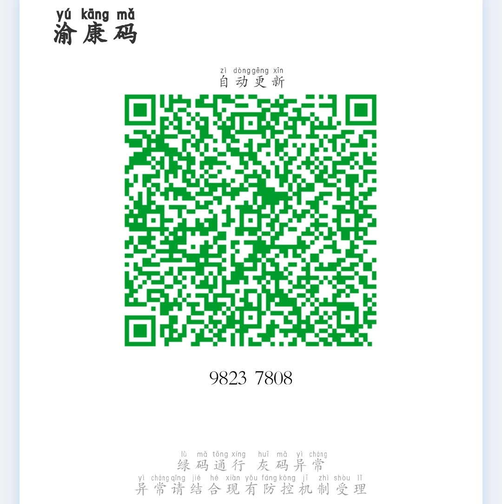
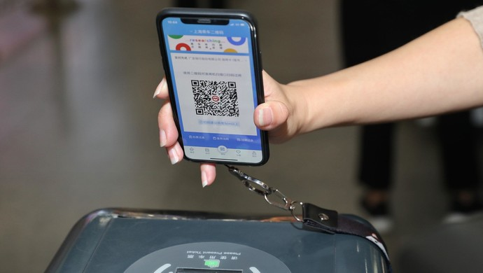
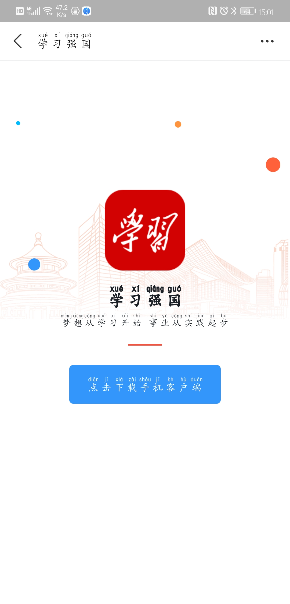
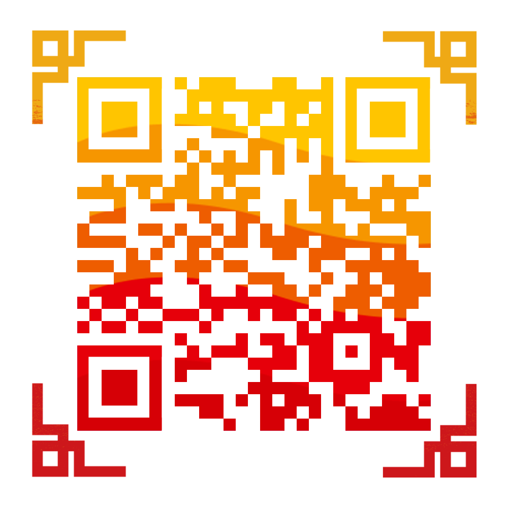
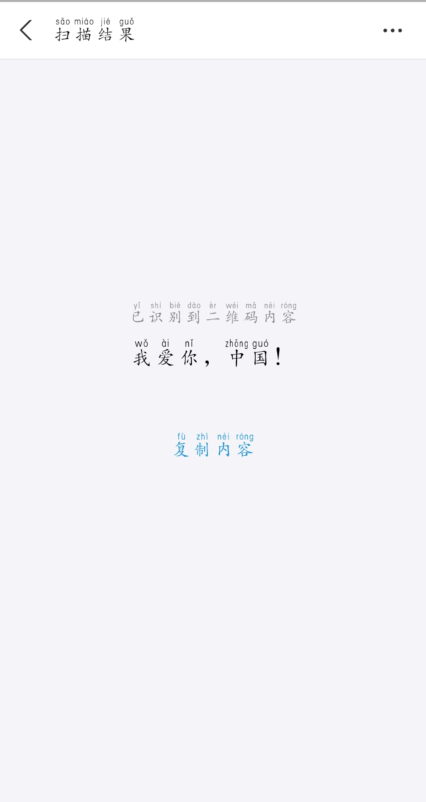
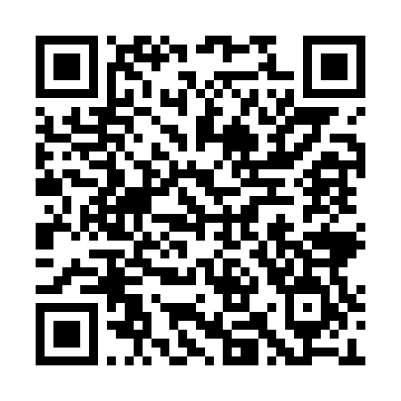

# 二维码-像素点的世界

## 引入二维码-应用场景介绍

大家好，欢迎进入二维码的世界。现在生活中出现各种二维码，

二维码是将现实世界和数字世界连通的一种简单可行的方式。

每当我看到一个二维码，我都会想扫一扫，看看它后面隐藏了什么东西，二维码就是这样让我着迷。

下面先介绍一下常见的二维码

例如健康码，疫情期间，健康码为疫情防控做出了突出贡献。

- 健康码-渝康码


- 交通码：现在的公交地铁，不仅可以使用交通卡，地铁票，还可以使用二维码扫码进站。


- 支付码-随着现代技术的发展，无现金时代的来临，通常只需要使用云闪付、支付宝、微信等支付工具，就可以快速结账、转账、交易。


- 扫码登录-现在登录网上账户上，不仅可以输入账号密码登录，还可以使用更安全快捷的扫描登录。


- 扫码下载应用：在APP推广下载的时候，我们常常可以看见扫码安装，拿出手机，使用带扫码功能的软件，例如微信，可以快速下载安装应用。



- 普通二维码：这是一个普通的中国红的二维码，大家可以使用APP扫一下。

可以看到，里面的内容很简单，就是“我爱你，中国！”这句话。


可以看出，二维码已经成为日常生活使用最广泛的技术之一，渗入到生活的方方面面，你还能列举更多的应用场景吗？

## 认识二维码

在认识二维码之前我们先看一下一维码！


何为一维码呢？所谓一维码，也就是条形码，超市里的商品条形码，书本后面的条码--这个相信大家都非常熟悉，条形码实际上就是一串数字，它上面存储了商品的序列号。

### 商品条码--EAN条码简介

　　EAN条码是国际物品编码协会指定且全球通用的一种商品条码，用于表示商品标识代码的条码，它有标准版（EAN-13）和缩短码（EAN-8）两种。这两种条码的最后一位为校验位，由前面的12位或7位数字计算得出。它们的编码方式可参考国家标准GB 12904-2008《商品条码零售商品编码与条码表示》。

　　商品条码的编码遵循唯一性原则，以保证商品条码在全世界内不重复，即一个商品项目只能有一个代码，或者说一个代码只能标识一种商品项目。不同规格、不同包装、不同品种的商品只能使用不同的商品代码。

商品条码具有以下特性：

① 只能储存数字。

② 可双向扫描处理，即条码可由左至右或由右至左扫描。

③ 必须有一检查码，以防读取资料的错误情形发生，位于EAN码中的最右边处。

④ 具有左护线、中线及右护线，以分隔条码上的不同部分与撷取适当的安全空间来处理。

⑤ 条码长度一定，较欠缺弹性，但经由适当的管道，可使其通用于世界各国。

## 二维码

二维码其实与条形码类似，只不过它存储的不一定是数字，还可以是任何的字符串，你可以认为，它就是字符串的另外一种表现形式。

### 历史

　条码技术自20世纪70年代问世以来，发展十分迅速，仅仅20年时间，它已广泛应用于商业流通、仓储物流、医疗卫生、图书情报、邮政、铁路、交通运输、生产自动化管理等领域。条码技术的应用极大提高了数据采集和信息处理的速度，改善了人们的工作和生活环境，提高了工作效率，并为管理的科学化和现代化做出了重要贡献。

　二维条码技术是在一维条码无法满足实际应用需求的前提下产生的。由于受信息容量的限制，一维条码通常是对物品的标识，而不是对物品的描述，因此相当依赖电脑网路和资料库。在不便连接网路或没有资料库的地方，一维条码很难派上用场。

从符号学的角度讲，二维条码和一维条码都是信息表示、携带和识读的手段。从应用角度讲，尽管在一些特定场合我们可以选择其中一种条码来满足我们的需要，但他们的应用侧重点是不同的：一维条码是对“物品”的标识，二维条码是对“物品”的描述。也可以说，二维条码的信息承载量较一维条码更大。

**二维条码**是指在一维条码的基础上扩展出另一维具有可读性的条码，使用黑白矩形图案表示二进制数据，被设备扫描后可获取其中所包含的信息。一维条码的宽度记载着数据，而其长度没有记载数据。二维条码的长度、宽度均记载着数据。二维条码有一维条码没有的“定位点”和“容错机制”。容错机制在即使没有辨识到全部的条码、或是说条码有污损时，也可以正确地还原条码上的信息。二维条码的种类很多，不同的机构开发出的二维条码具有不同的结构以及编写、读取方法。

我们最常见的二维码就是矩阵式二维码（又称棋盘式二维条码），QR CODE，（Quick Response Code，由[Denso](https://baike.baidu.com/item/Denso/9887723)公司于1994年9月研制）是指由一些中心到中心距离固定的多边形单元组成的用于表示数据或其他与符号相关的功能图形。它可能包含与一维条码不相关的成分组成规则不同的识别图形。矩阵式二维条码具有的优点在很大程度上直接推动了二维条码的发展。近年来出现了许多新型的二维条码符号，被广泛地应用到自动识别的不同领域。

　　**一维条码在应用时暴露出的缺点：**

1）数据容量较小，只30个字符左右。

2）只能包含字母和数字。

3）条码尺寸相对较大（空间利用率较低）。

4）条码遭到损坏后不能识读。

　　**二维条码的主要特点：**

1）高密度编码：信息容量大，比普通一维条码信息量约高几十倍。

2）编码范围广：可以把图片、声音、文字、签字、指纹等数字化的信息进行编码，用条码表示出来。

3）容错能力强：具有纠错功能：在二维条码因穿孔、污损等引起局部损坏时，照样可以正确得到识读。

5）可引入加密措施：保密性、防伪性好。 

6）成本低，易制作，持久耐用。 

7）条码符号形状、尺寸大小比例可变。 

# 用相同的内容制作的二维码为什么图案不同

基本概念：二维条码/二维码（2-dimensional bar code）是用某种特定的几何图形按一定规律在平面（二维方向上）分布的黑白相间的图形记录数据符号信息的；在代码编制上巧妙地利用构成计算机内部逻辑基础的“0”、“1”比特流的概念，使用若干个与二进制相对应的几何形体来表示文字数值信息，通过图象输入设备或光电扫描设备自动识读以实现信息自动处理：它具有条码技术的一些共性：每种码制有其特定的字符集；每个字符占有一定的宽度；具有一定的校验功能等。同时还具有对不同行的信息自动识别功能、及处理图形旋转变化点。

同样的内容，不做任何修改，反复生成的二维码图案都不一样。这是由于这些特定的几何图形按照一定规律，然后随机的分布在平面上。打个比方，一个句子，我们从左到右写，和从上到下写，表达的都是同一个意思。二维码也是一样。

# 什么是容错率

容错率也叫纠错率，就是指二维码可以被遮挡后仍能被正常扫描，而这个能被遮挡的最大面积就是容错率。 。 容错率越高，则二维码图片能被遮挡的部分越大。

二维码在编码过程中进行了冗余，就像是123被编码成123123，这样只要扫描到一部分二维码图片，二维码内容还是可以被全部读到。

最常见的QR二维码，用的是里德-所罗门码（RS）来做纠错。分有几级，纠错级别越高，整体需要携带的信息越多：

二维码容错率用字母表示，容错能力等级分为：L、M、Q、H四级：

| 容错能力等级 | 二维码容错率 |      含义       |
| :----------: | :----------: | :-------------: |
|      L       |      7%      | 可纠正约7%错误  |
|      M       |     15%      | 可纠正约15%错误 |
|      Q       |     25%      | 可纠正约25%错误 |
|      H       |     30%      | 可纠正约30%错误 |

并不是所有位置都可以缺损，像最明显的那三个角上的方框，直接影响初始定位。中间零散的部分是内容编码，可以容忍缺损。

## 如何选择容错率

那么如何选择容错率呢？大多数情况下，建议采用30%的容错率。因为有公司做了调查，通过各种型号手机的扫描测试。结果是:对目前主流手机，在绝大多数扫描场景下，容错率越高，越容易被快速扫描。

当然，高容错率的代价是图片的复杂度提高，在实际操作中可以根据你的实际需求选择相应的容错级别。

再次强调，二维码边上的三个定位框和中间定位小块不能被遮挡。否则容错率再高也无法扫描。你可以尝试一下。

## 二维码制作

我们知道，通过二维码可以访问很多东西，不仅仅是数字，文本，还可以是图片、音频、表单等内容，这是怎么实现的呢？

其实是通过一种活码的技术。

### 活码的原理

活码是二维码的一种高级形态，通过短网址指向保存在云端的信息。图案和普通二维码比较更简单更易扫描，而且可以随时更改云端内容，做到同一个图案，不同的内容。极大的方便了二维码的印刷管理，甚至可以先印刷图案，后设置内容。二维码图案不变，内容可随时更改，存储无限内容，指向任意网址，扫描效果可跟踪。

从理论上来说，活码可以支持无限的内容，但是受到网络带宽和服务器性能等限制，实际操作中，输入过多文字还是会影响活码生成和扫描打开的速度。所以，实际操作中，还是需要把握活码的使用。

 这项技术，原理非常简单，却很实用。现在很多软件和应用程序都可以创建这样的二维码。

### 使用python脚本生成

安装python依赖包`qrcode`

```shell
pip install qrcode
```
#### 基础版
代码:

```python
import qrcode

#调用qrcode的make()方法
qr_img = qrcode.make('http://www.xinhuanet.com/politics/2021-03/24/1127247261_16181898335971n.jpg')
#生成二维码图片
with open('中国共产党成立100周年庆祝活动标识.png', 'wb') as f:
    qr_img.save(f)
```



#### 高阶版

安装python依赖包`matplotlib`

```shell
 pip install matplotlib
```

代码:

```python
import qrcode
from PIL import Image
import matplotlib.pyplot as plt


def getQRcode(data, file_name):
    qr = qrcode.QRCode(
        version=10,
        error_correction=qrcode.constants.ERROR_CORRECT_H,
        box_size=10,
        border=4,
    )
    # 添加数据
    qr.add_data(data)
    # 填充数据
    qr.make(fit=True)
    # 生成二维码模板图片
    img = qr.make_image(fill_color="blue", back_color="white")

    # 添加logo
    icon = Image.open("重庆水电职院校徽.png")
    # 获取图片的宽高
    img_w, img_h = img.size
    # 参数设置logo的大小
    factor = 4
    size_w = int(img_w / factor)
    size_h = int(img_h / factor)
    icon_w, icon_h = icon.size
    if icon_w > size_w:
        icon_w = size_w
    if icon_h > size_h:
        icon_h = size_h
    # 重新设置logo的尺寸
    icon = icon.resize((icon_w, icon_h), Image.ANTIALIAS)
    # 得到画图的x，y坐标，居中显示
    w = int((img_w - icon_w) / 2)
    h = int((img_h - icon_h) / 2)
    # 黏贴logo照
    img.paste(icon, (w, h), mask=None)
    # 保存img
    img.save(file_name)
    print('二维码制作成功！')


if __name__ == '__main__':
    getQRcode("http://www.cqsdzy.com/", 'cqsdzy.png')

```


### 使用草料二维码

[草料文本二维码生成器 ](https://cli.im/text)

<https://cli.im/text>


### 使用二维码app生成

请各位自行在手机应用商店搜索下载二维码工具尝试。

### 普通二维码

### logo二维码

### 动态二维码

 

