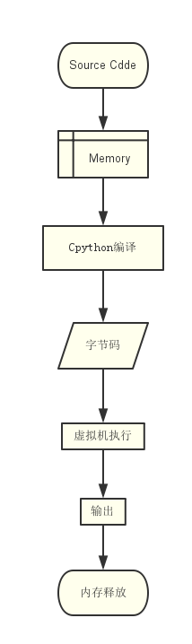

# Python 解释器

Python 的实现方式主要分为三大类

1. Cpython
2. Jpython
3. IronPython

## CPython

`Cpython`是默认的 Python 解释器，这个名字根据它是可移植的`ANSI C`语言代码编写而成的这事实而来的。

当执行 Python 执行代码的时候，会启用一个 Python 解释器，将源码`(.py)`文件读取到内存当中，然后编译成字节码`(.pyc)`文件，最后交给 Python 的虚拟机`(PVM)`逐行解释并执行其内容，然后释放内存，退出程序。

当第二次在执行当前程序的时候，会先在当前目录下寻找有没有同名的 pyc 文件，如果找到了，则直接进行运行，否则重复上面的工作。

pyc 文件的目的其实就是为了实现代码的重用，为什么这么说呢？因为 Python 认为只要是 import 导入过来的文件，就是可以被重用的，那么他就会将这个文件编译成 pyc 文件。

python 会在每次载入模块之前都会先检查一下 py 文件和 pyc 文件的最后修改日期，如果不一致则重新生成一份 pyc 文件，否则就直接读取运行。

## Jython

Jython 是个 Python 的一种实现方式，Jython 编译 Python 代码为 Java 字节码，然后由 JVM（Java 虚拟机）执行，这意味着此时 Python 程序与 Java 程序没有区别，只是源代码不一样。此外，它能够导入和使用任何 Java 类像 Python 模块。

## IronPython

IronPython 是 Python 的 C#实现，并且它将 Python 代码编译成 C#中间代码（与 Jython 类似），然后运行，它与`.NET` 语言的互操作性也非常好。

## 参考

- [Python 全栈之路系列之基础篇](https://github.com/anshengme/blog/edit/master/source/_posts/python-full-stack-way-basics.md)
