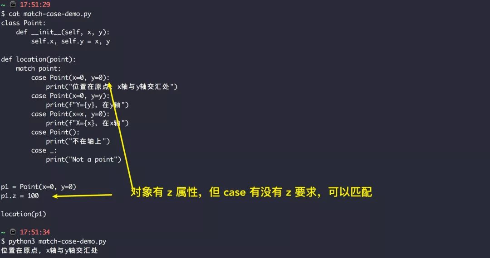
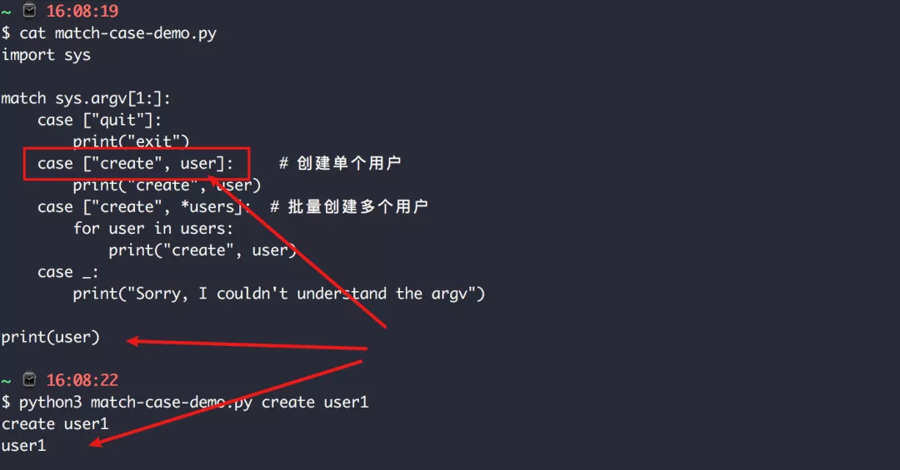
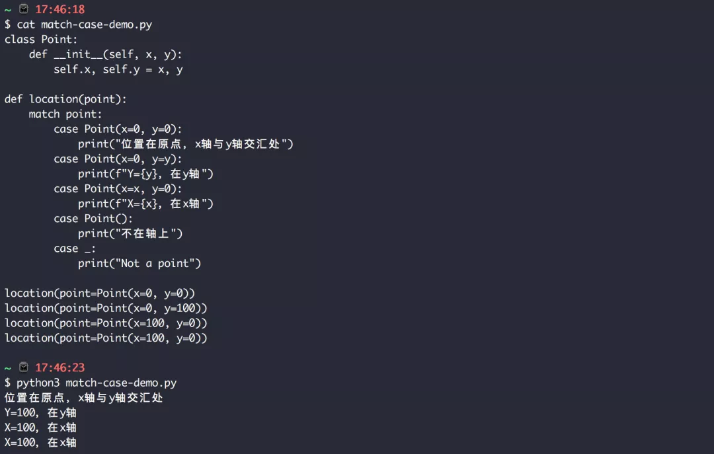
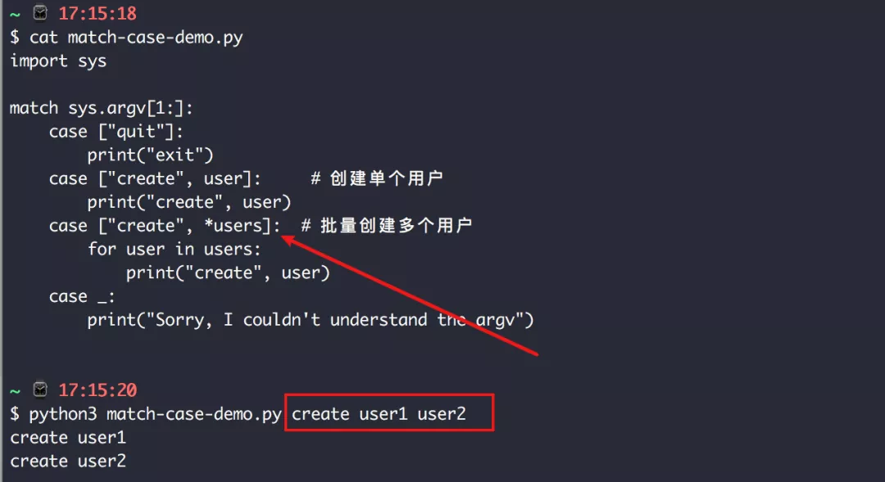

# [match-case](https://mp.weixin.qq.com/s/I8Gwv-dY-4gGaHdv0Hqs4w)

结构模式匹配

最简单的一个 match-case 的例子

```
def http_error(status):
    match status:
        case 400:
            print("Bad request")
        case 404:
            print("Not found")
        case 418:
            print("I'm a teapot")
        case _:
            print("Something's wrong with the internet")
```

###  1. 升级 3.10 新版本

###  2. or 模式的使用

在上面我已经贴出一个 match-case 的最简单示例，这边就直接跳过简单示例，来说说那些比较特殊的用法。

在 Python 3.10 中其实有新增一个 联合类型操作符 `|` ，但这个只能用于类型，具体的用法，我会在下一篇文章中做详细的介绍，本篇文章还是集中于 match-case 的使用。

在学习match-case 的时候，你会发现，也有一个类似于联合类型操作符的用法，但请你要注意区别，它并不是联合类型操作，而是在 match-case 下独有的 **or模式操作符** `|` ，它可以将多个具体相同逻辑的 case 语句简写成同一个

```
match status:
    case 401 | 403 | 404:
        print("Not allowed")
    case _:
        print("Something's wrong with the internet")
```

###  3. 通配符匹配任意对象

match-case 的出现有利于提高代码的可读性，让你的代码更加优雅，但同时要使用好它，也是有一些门槛的，特别是通配符的使用。

下边我举一些例子来进行讲解

在如下代码中，使用了通配符 `_` 和 可变参数中的  `*` 符号

```
import sys

match sys.argv[1:]:
    case ["quit"]:
        print("exit")
    case ["create", user]:     # 创建单个用户
        print("create", user)
    case ["create", *users]:  # 批量创建多个用户
        for user in users:
            print("create", user)
    case _:
        print("Sorry, I couldn't understand the argv")
```

最后一个 case 中的 `_` 并不作为变量名，而表示一种特殊的模式，在前面的 case 中都未命中的情况下，该 case 会是最后的保障，能确保命中，它相当于 Go 语言中的 `default` 分支。

```
import "fmt"

func main() {
    education := "本科"

    switch education {
    case "博士":
        fmt.Println("我是博士")
    case "研究生":
        fmt.Println("我是研究生")
    case "本科":
        fmt.Println("我是本科生")
    case "大专":
        fmt.Println("我是大专生")
    default:
        fmt.Println("学历未达标..")
    }
}
```

###  4. 使用可变参数 *args

第二个 case 和 第三个 case 非常的像，区别在于第三个 case中 `users` 前加了个 `*`，他跟原 Python 函数中的可变参数是一个用法，会匹配列表的多个值。

在该中表示可以从命令行参数中批量创建用户。



在 match-case 中相应的 case 若有运行到，对应的变量是会被创建的。比如



###  5. 使用可变参数 **kv

在如下代码中，`**rest` 会匹配到所有的 args 中的 key 和 value


###  6. 长度的匹配方式

若你希望使用 case 仅对对象的长度做一些匹配，可以使用下面这样的方式

- `[*_]` 匹配任意长度的 `list`;
- `(*,* , *_)` 匹配长度至少为 2 的 `tuple`。

###  7. 类对象的匹配

对于类对象的匹配，下边这个例子足够简单，不再讲解。



###  8. 匹配要注意顺序

在上边基本介绍完了 match-case 的使用方法，如需更详细的内容，不如去通读下 PEP 636(*https://www.python.org/dev/peps/pep-0636/*) 的内容。

在文章最开始的时候，我说过开发者应该对这些新特性 **心存敬畏**，match-case 这样一个看似简单的新功能，却有着不少的学习成本，如果对 **结构模式匹配** 半知半解的人来说，可能会增大代码出错的概率，并不是大数人都能轻松驾驭的。

之所以会这么说，是因为 match-case 在面对不同的对象，它的匹配的规则也有所不同。

- 当 match 的对象是一个 list 或者 tuple 的时候，需要长度和元素值都能匹配，才能命中，这就是为什么下面这个例子走的是第三个 case 而不是第二个 case。




- 当 match 的对象是一个 dict 的时候，规则却有所不同，只要 case 表达式中的 key 在所 match 的对象中有存在，即可命中。


- 而当 match 的对象是类对象时，匹配的规则是，跟 dict 有点类似，只要对象类型和对象的属性有满足 case 的条件，就能命中。


因此在写 match-case 的时候，最大的难点可能就是如何把握这个顺序，才能确保你写的代码不会翻车。

我个人总结一些规律，仅供大家参考：

- list 或者 tuple：应该从不格式到严格
- dict 或者 object：应该从严格到不严格

在经过半天时间的尝鲜后，我有了一些自己的理解，分享给大家，不知道我的理解有没有问题，但我依然建议大家在 **充分了解 match-case 的匹配规则** 后，再去使用它。

