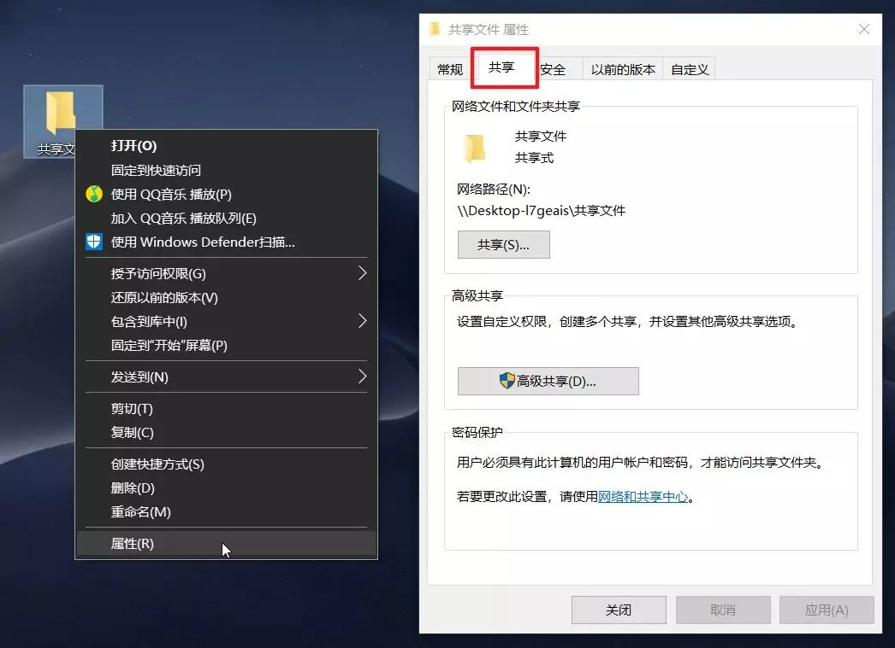
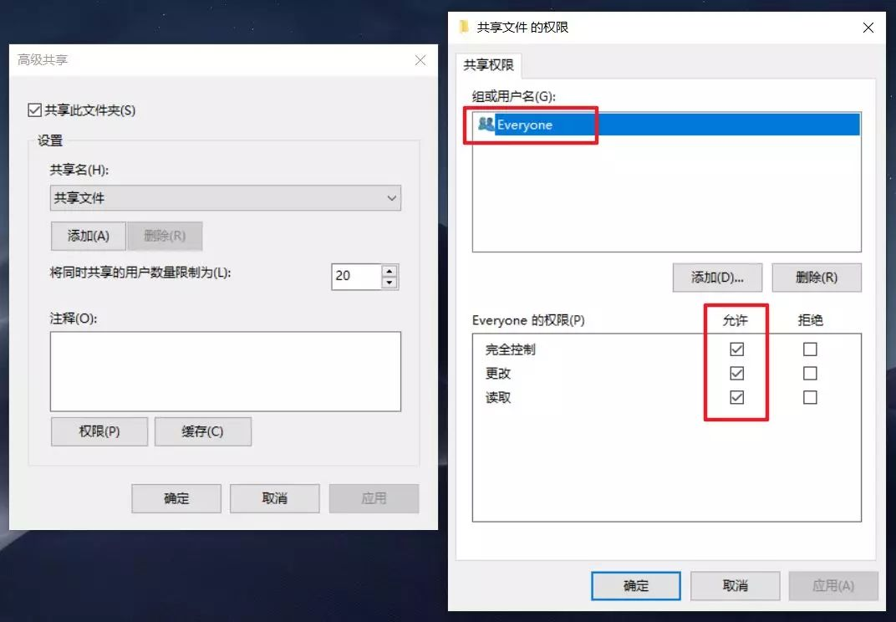
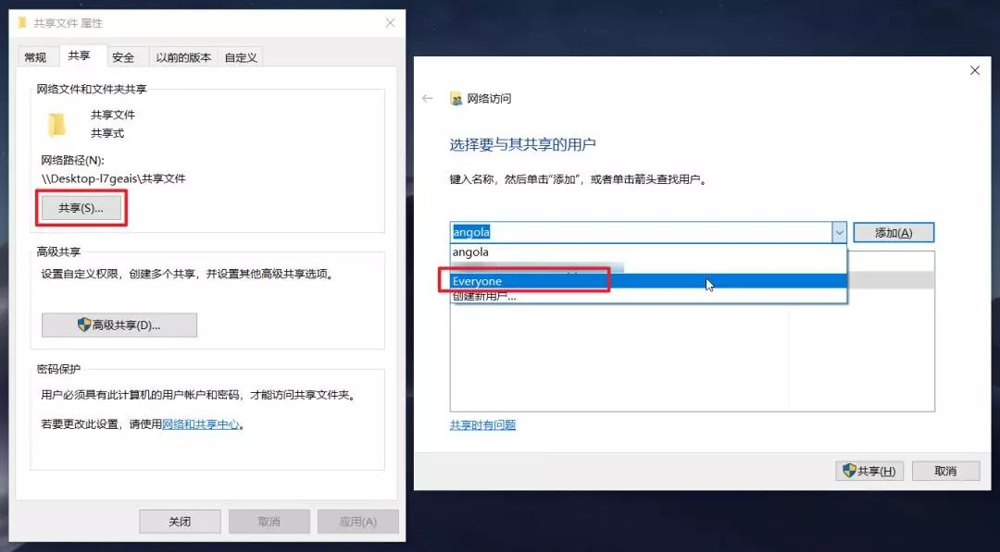
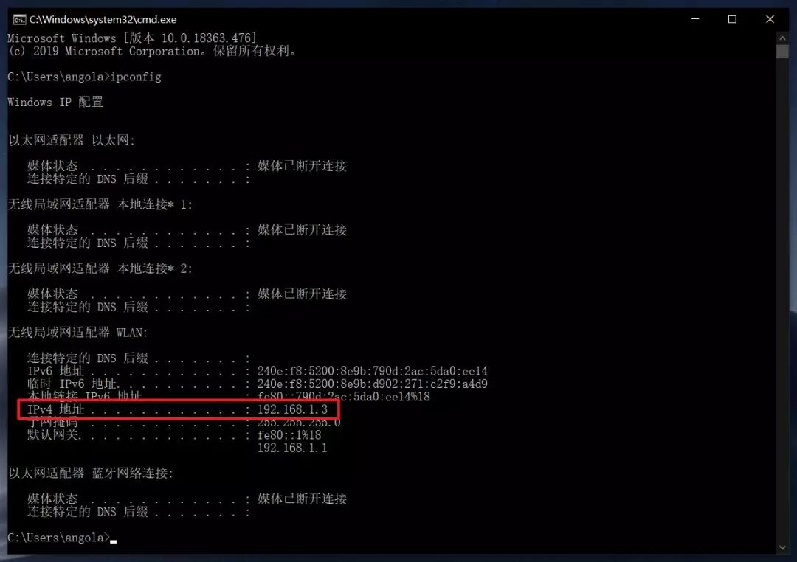
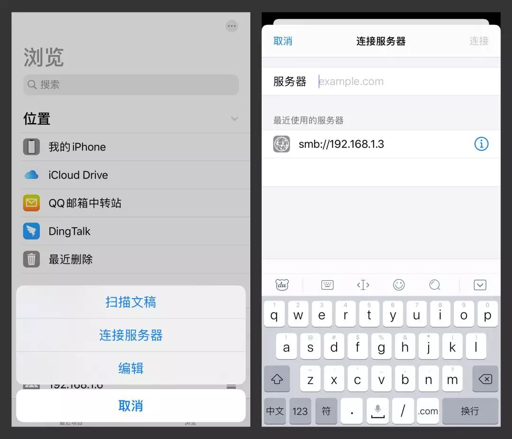
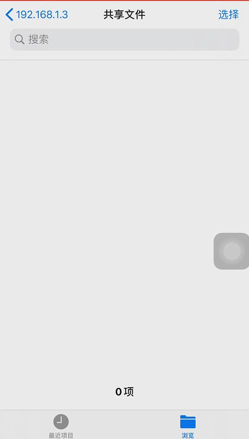

# ios

## a-shell

## 文件

文件，是iPhone原生的**文件管理器**，可以方便用户查看散落在各个App中的文件。

在最新的iOS13系统中，文件App**新增了不少新特性**，如压缩/解压文件、扫描文稿以及文件共享。

**文件共享**，我觉得是文件App最值得使用的功能，因为它可以实现**iPhone与Windows**电脑的文件共享，为不同生态间的**文件传输**提供了新的方式。

使用文件共享前，需要先在PC上进行设置。

在电脑的任意位置，新建一个文件夹，右击选择「**属性**」，在弹出的属性面板中，切换到「**共享**」选项卡。

点击「**高级共享**」，在弹出的窗口中，勾选「**共享此文件夹**」，接着点击下方的「**权限**」按钮。

在打开的「权限」面板中，选中「组或用户名」的**Everyone**，在下方的Everyone权限中，勾选「允许」列下方的**三个权限**，完成后点击确定。

回到最开始的「属性」面板，点击「共享」，会弹出「**网络访问**」面板，这是用于设置共享文件夹的用户。

点击右侧的下拉框，选择**Everyone**，接着点击右侧的「**添加**」。

添加了Everyone之后，将其权限级别由读取更改为「**读取/写入**」，接着点击右下角的「**共享**」。

使用**快捷键Win+R**打开运行窗口，在运行框中输入**CMD**，打开命令行窗口，在窗口中输入**ipconfig**，敲击回车键，会得到一长串关于**IP配置**的内容。

IP配置的内容不需要看懂，我们只需要找到「**IPv4地址**」那一行信息，后面对应的192.168.1.3字符等下会用到。

至此，我们完成了文件共享前的准备工作，回到iPhone的「文件」App，点击右上角的设置按钮，选择「**连接服务器**」。

在服务器输入框，输入格式为「**smb://IPv4地址**」，这个IPv4地址，就是前面说的会用到的字符，这里我输入的是「**smb://192.168.1.3**」，接着点击右上角的「**连接**」。

点击连接后，连接身份选择「**注册用户**」，下方的名称和密码分别是**电脑的用户名和登录密码**，接着点击下一步。

完成以上所有步骤，如果没有遇到障碍的话，就可以在手机上看到电脑共享的文件夹了，如下图右侧名为「共享文件」的文件夹。

当你在PC上将一份文件拖拽到共享文件夹中，在手机就能瞬间看到相同的文件，**传输速度真的感人**。

